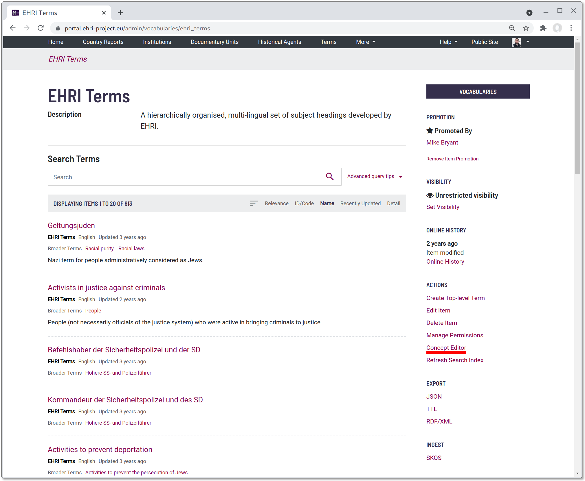
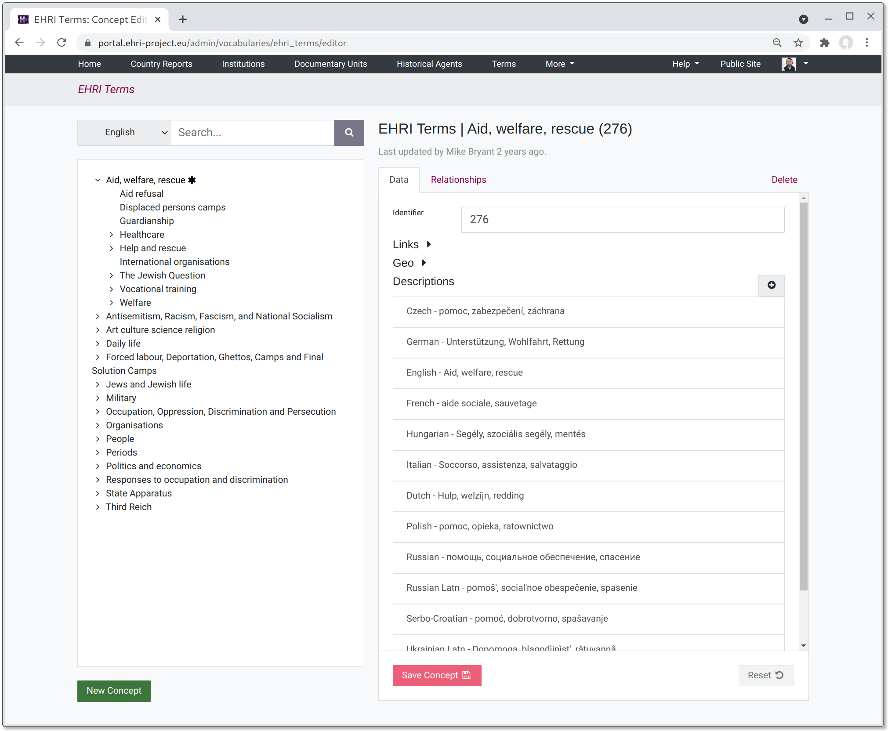
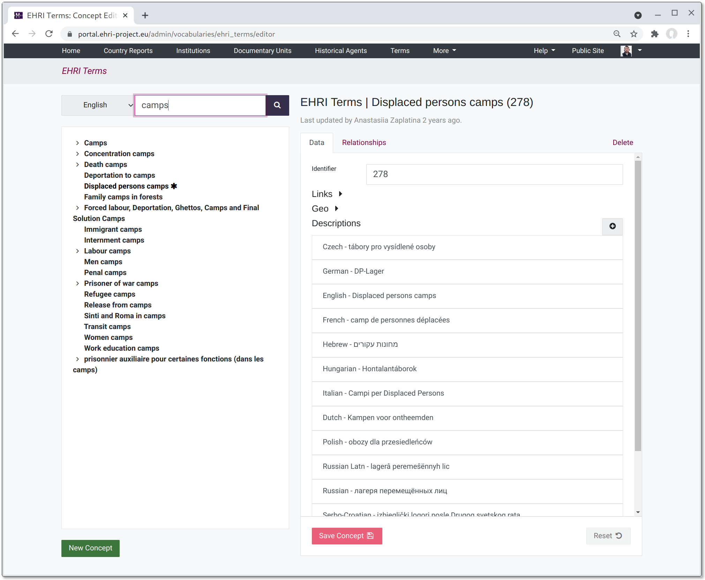
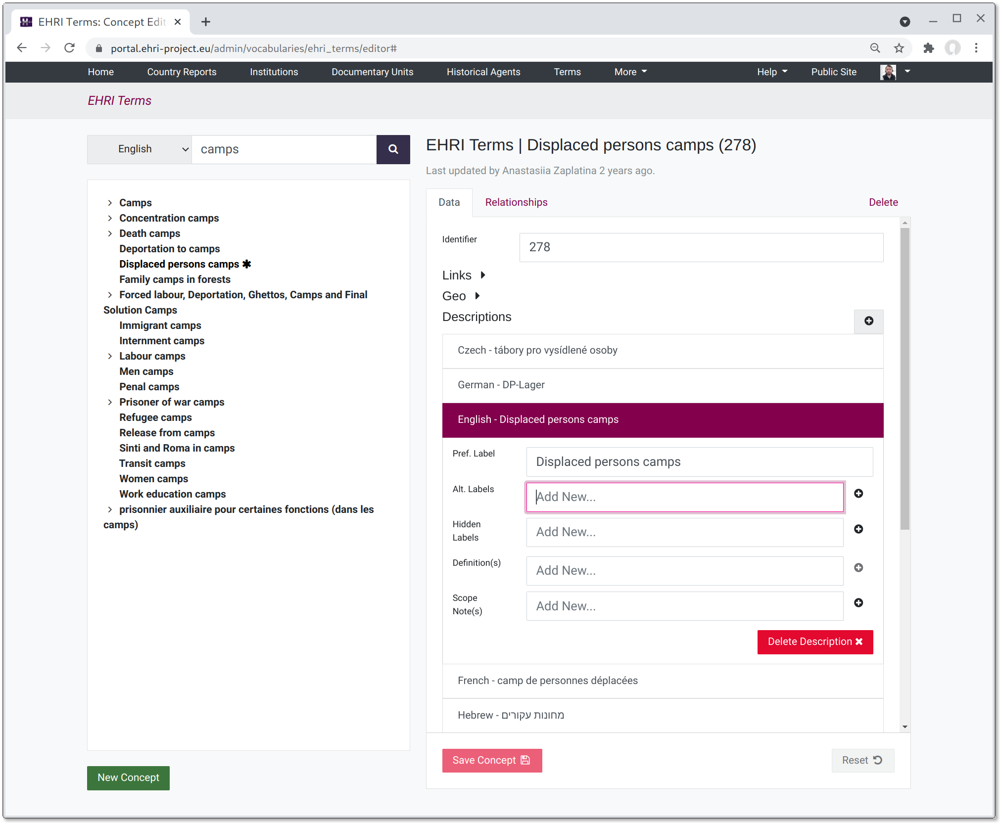
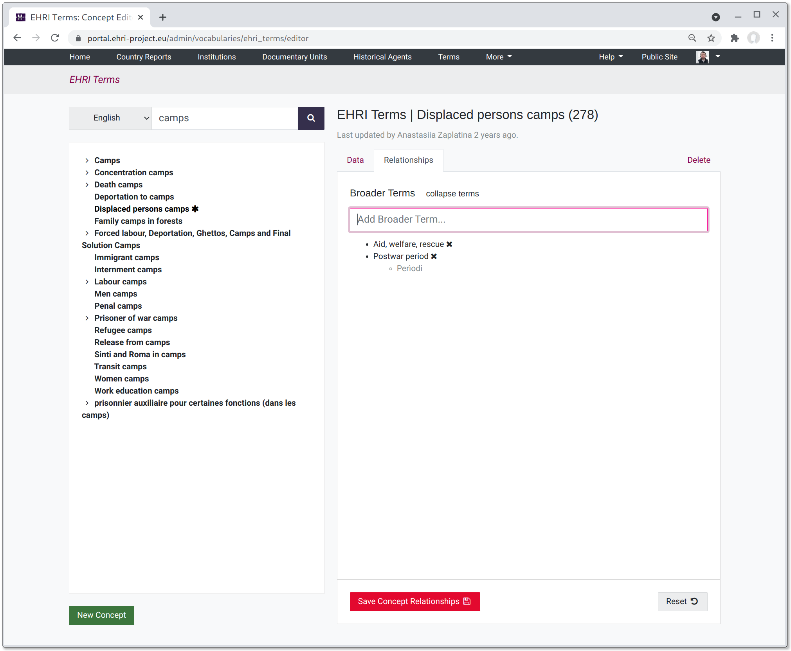

***************************
Editing Vocabulary Concepts
***************************

While vocabulary terms (or "concepts", in SKOS parlance) can be edited using a form-based interface much like archival descriptions,
a faster and more convenient interactive interface is available that makes it easier to understand the structure of an entire
vocabulary. To access the concept editor, navigate to a vocabulary in the portal admin and select the "Concept Editor" link from
the right-hand-side menu:

|image-link|

The concept editor consists of two panes. On the left-hand-side is a list of all the concepts in the vocabulary. The pane on
the right shows information about the currently-selected concept (or a new concept).

|image-overview|

You can filter the list by searching in the box at the top, and also select which language is used to display the labels (if more
than one language is present).

|image-search|

Properties for a selected concept can be edited on the RHS pane. Some properties, such as the URL, and where applicable,
geospatial attributes, apply to a concept as a whole. Other properties such as preferred labels, alternative labels,
definitions and scope notes are language-specific. **NOTE**: make sure you click "Save Concept" after editing the fields.
You can revert unsaved changes using the "Reset" button.

|image-description|

The only relationships that can be edited are a concepts *broader terms* (you cannot, for instance, add narrower terms to an item,
but since broader and narrower are effectively the same, just the inverse of each other, the same thing can be achieved using broader
terms.) To add a broader term, start typing its label in the relationship filter box and select the desired item. **NOTE**: make sure you
click "Save Concepts Relationships" after adding or removing broader terms from the list.

|image-rels|

Concepts can be deleted via the "Delete" tab, which will require you to check a confirmation box.

