******************************************************
How to create Connections between Originals and Copies
******************************************************

In the EHRI Portal we can create links between the archival institutions
which hold the original archival units and the archival institutions
which hold copies of the original archival unit.

Four types of connections between copies and originals can be created:

-  Original archival unit – Copy archival unit;
-  Original archival institution – Copy archival institution;
-  Original archival institution – Copy archival unit;
-  Original archival unit – Copy archival institution.

Before you start creating connections, please make sure you are working
in your Admin profile. A good idea would be to review the information
and tips & tricks described earlier.

Original archival unit – Copy archival unit
############################################

For our first type of connection we will work on linking an original
archival unit held in Warsaw, Poland with a copy collection held in
Vilnius, Lithuania.

Once you have identified the copy archival unit you want to connect, go
to Actions > Link to another item.

|image56|

Click on the ‘Link to another item’ button. In the opened window, search
for the original archival description with which you want to create a
link. Once you have found it, click on the ‘Create Copy Link’ button:

|image57|

A new page will open. Click on the ‘Create Relationship’ button:

|image58|

|image59|

Your Original archival unit – Copy archival unit was created, and you
can see this at the bottom of the page:

|image60|

Original archival institution – Copy archival institution
##########################################################

For our second type of connection we will work on linking an Original
archival institution to a Copy archival institution. In our example,
both institutions are located in France.

Once you have identified the copy archival institution you want to
connect, go to Actions > Link to an Institution:

|image61|

Click on the ‘Link to an Institution’ button. In the opened window
search for the Original archival institution with which you want to
perform the linking. Once you have found it, click on the Create copy
link button:

|image62|

A new page will open. Click on the ‘Create Relationship’ button:

|image63|

Your Original archival institution – Copy archival institution link has
been created and is visible at the bottom of the page:

|image64|

Original archival institution – Copy archival unit
###################################################

For our third type of connection we will work on linking a Copy Archival
Unit located in the USA to an Original archival institution located in
France.

Once you have identified the Copy archival unit you want to connect, go
to Actions > Link to an Institution:

|image65|

Click on the ‘Link to an Institution button’. In the opened window,
search for the Original archival institution with which you wish to
create a link. Once you have found it, click on the ‘Create Copy Link’
button:

|image66|

A new page will open. Click on the ‘Create Relationship’ button:

|image67|

Your Original archival institution - Copy archival unit link has been
created and is visible at the bottom of the page.

|image68|

Original archival unit – Copy archival institution
###################################################

For our fourth type of connection we will work on linking an original
archival unit to a copy archival institution. In our example, both of
them are located in Romania.

Once you have identified the Copy archival institution you want to link,
go to Actions > Link to an Archival Description:

|image69|

Click on the ‘Link to an Archival Description’ button. In the opened
window, search for the Original archival unit with which you want to
perform the linking. Once you have found it, click on the ‘Create Copy
Link’ button:

|image70|

A new page will open. Click on the ‘Create Relationship’ button:

|image71|

Your Copy archival institution – Original archival unit link has been
created and is visible at the bottom of the page:

|image72|

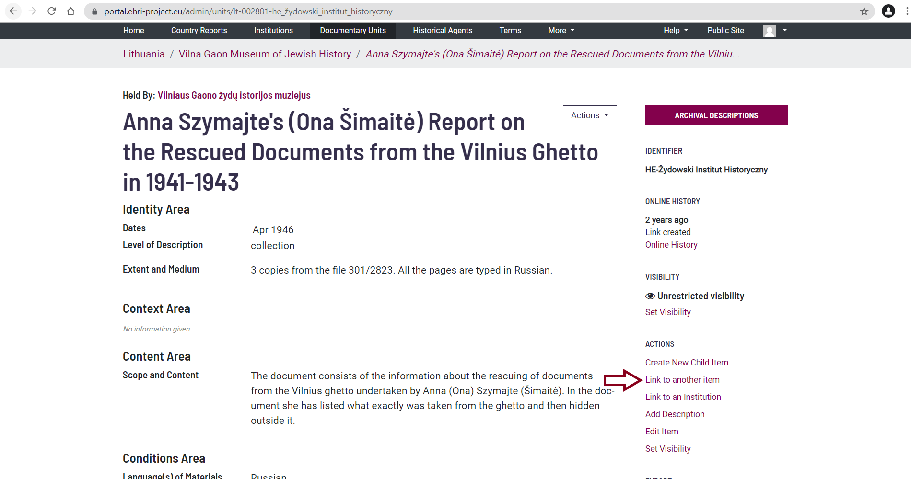
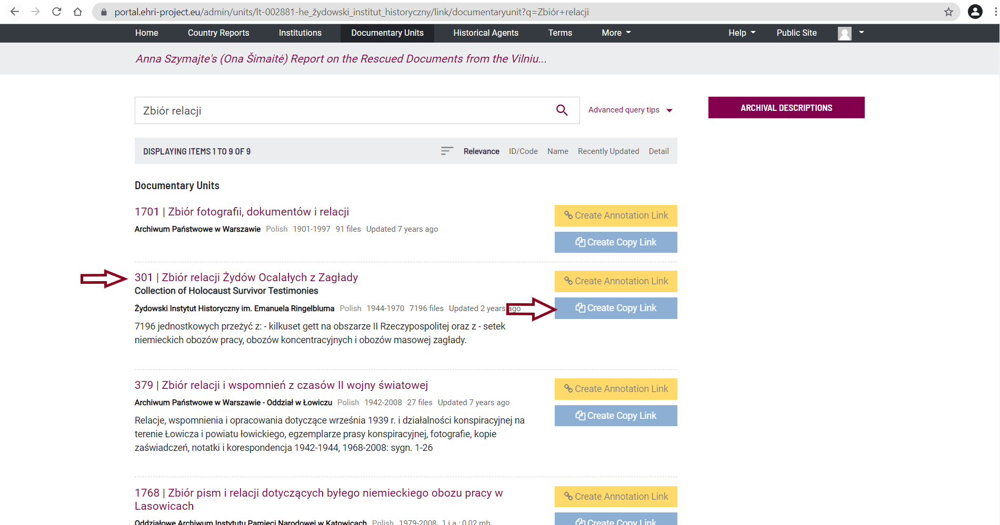
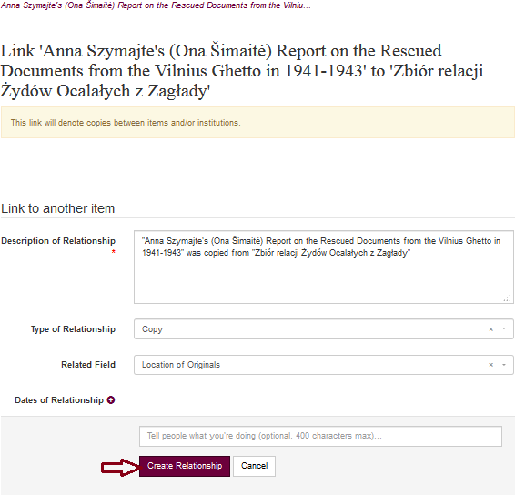
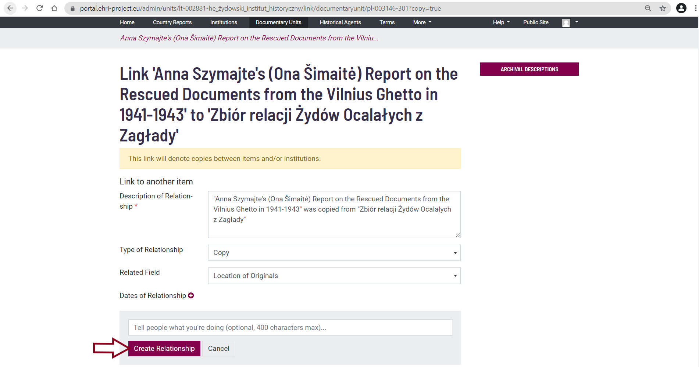
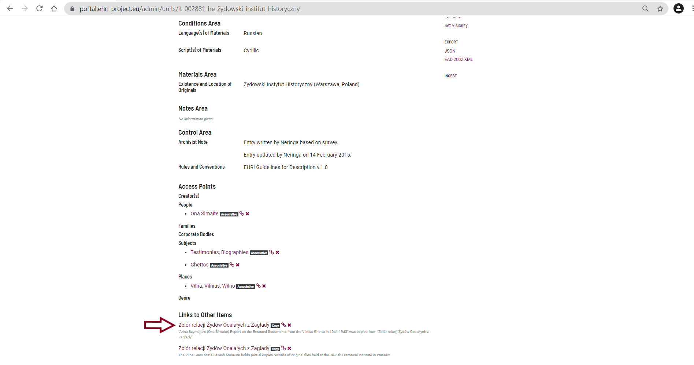
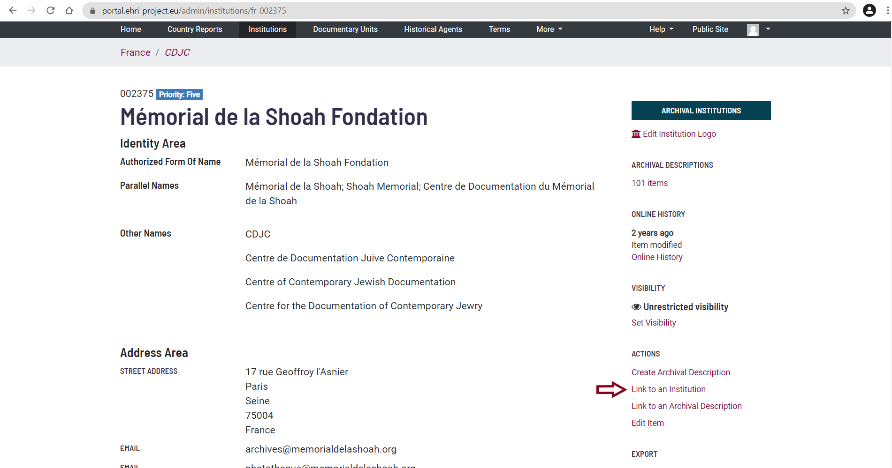
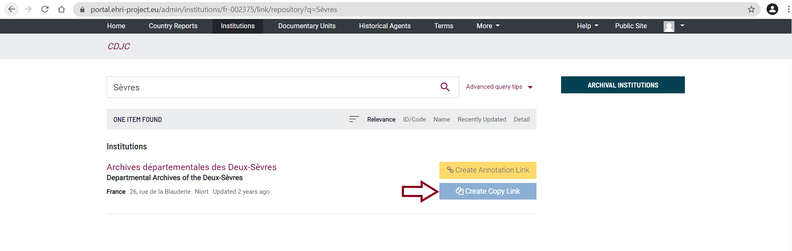
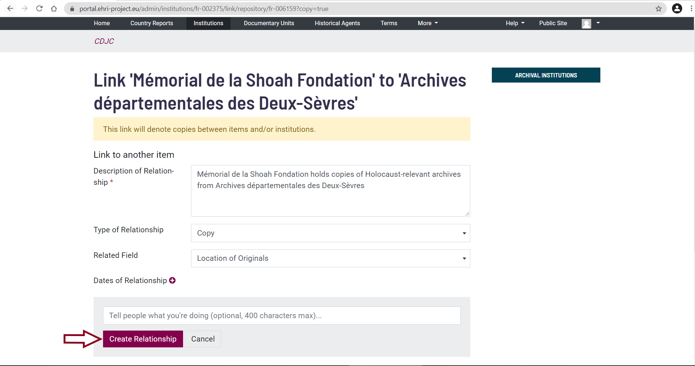
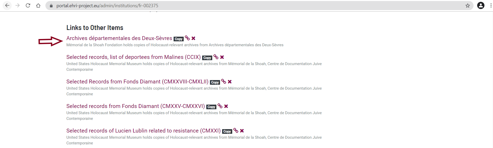
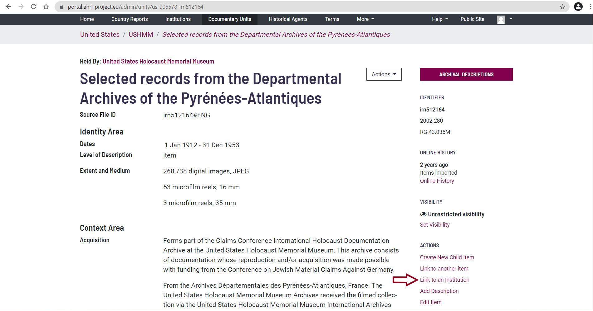
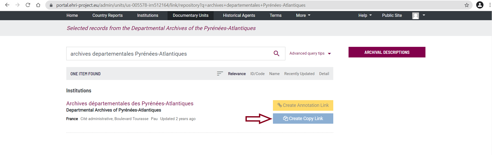
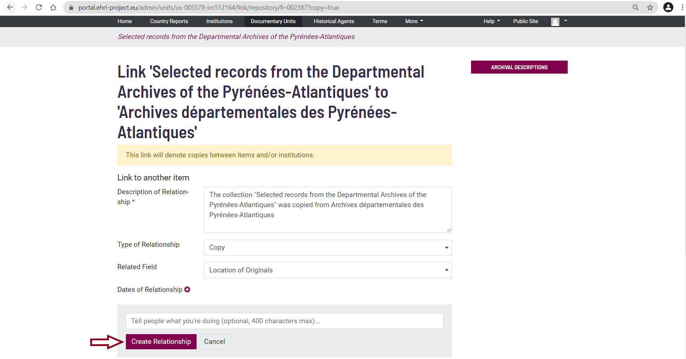
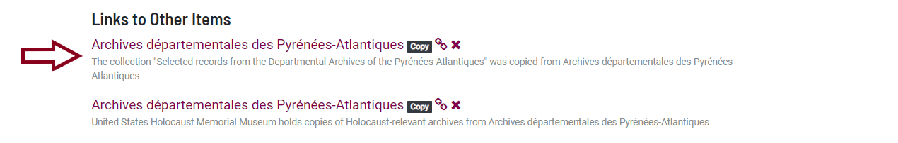
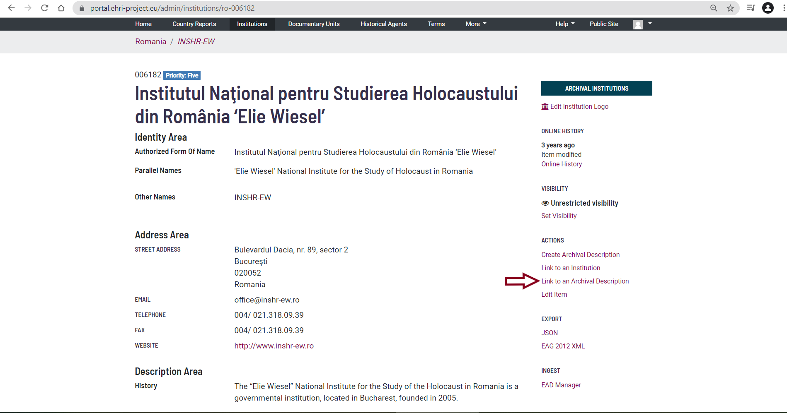
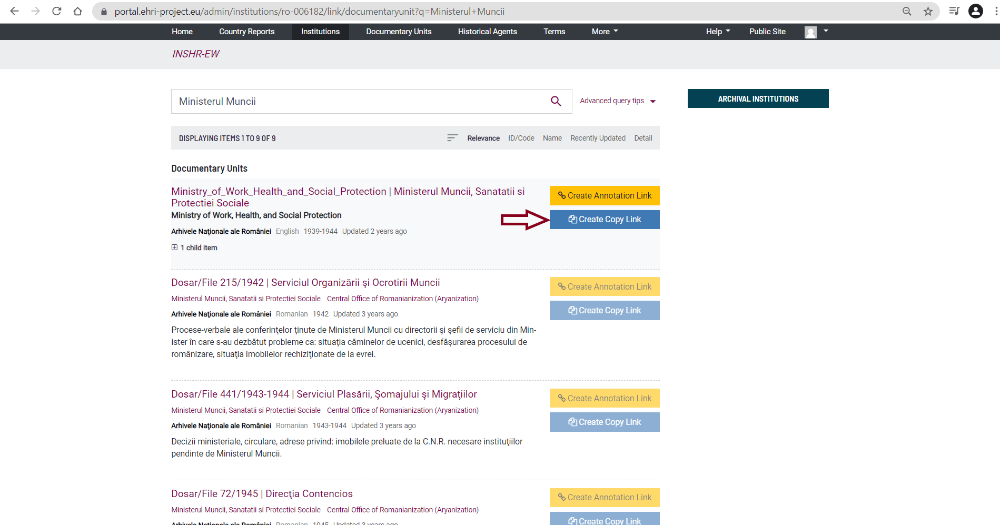
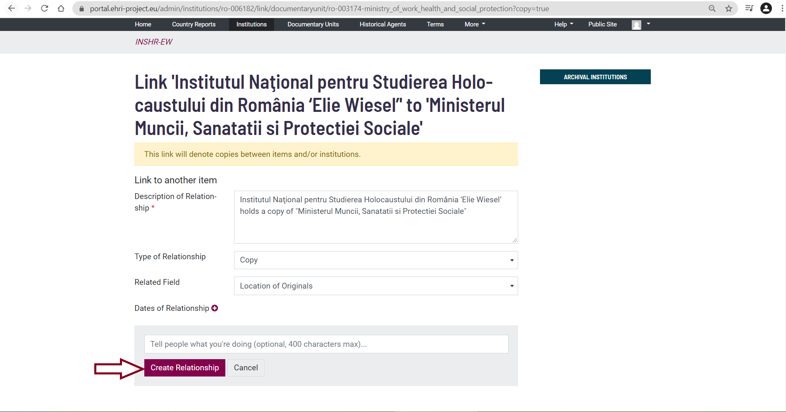
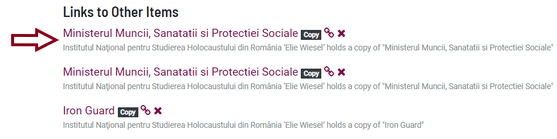