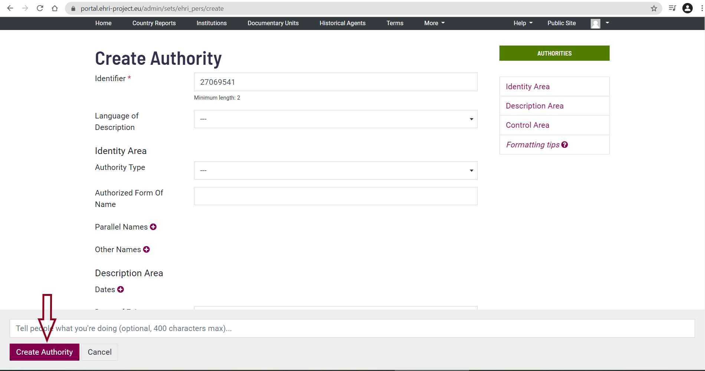
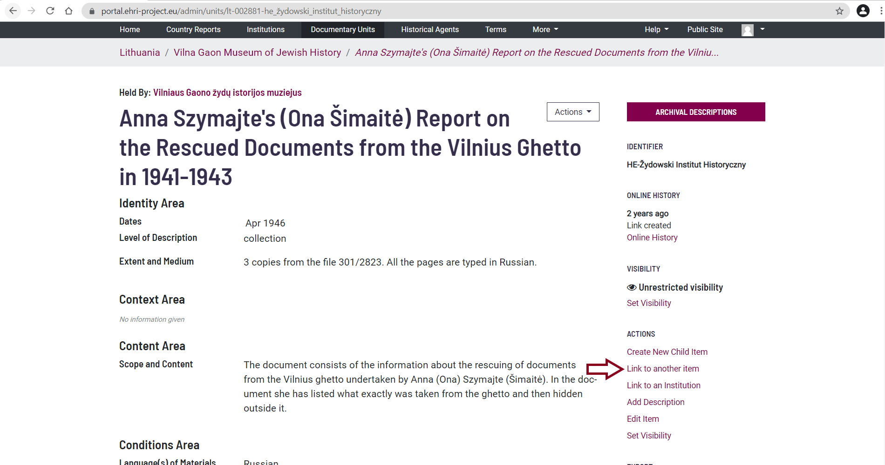
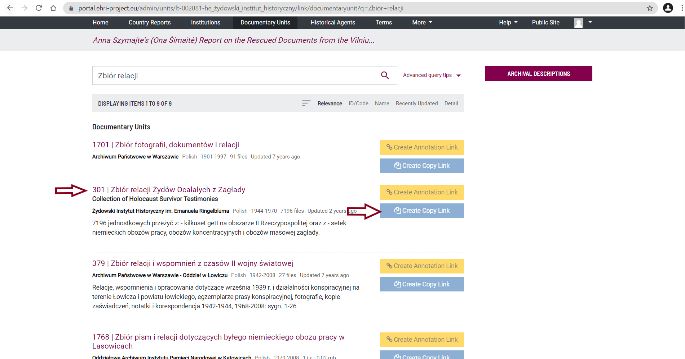
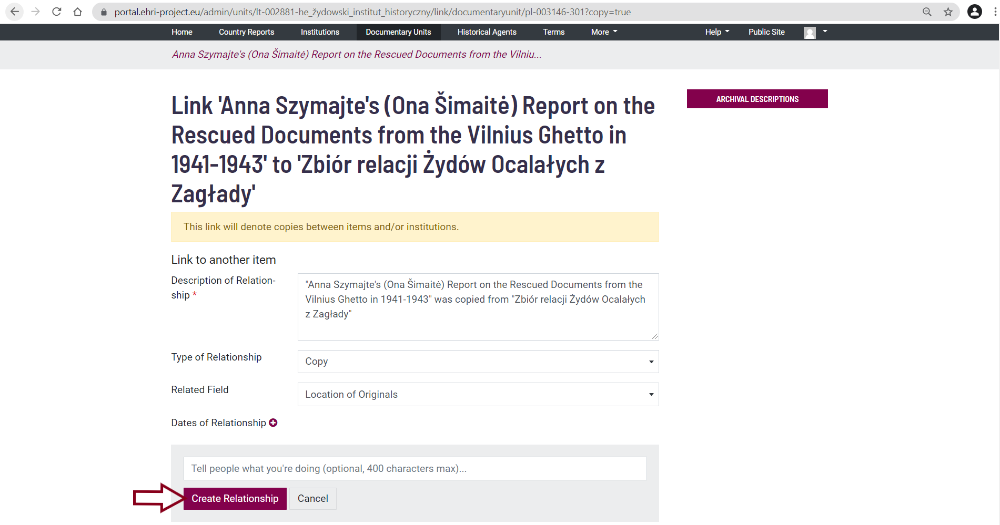
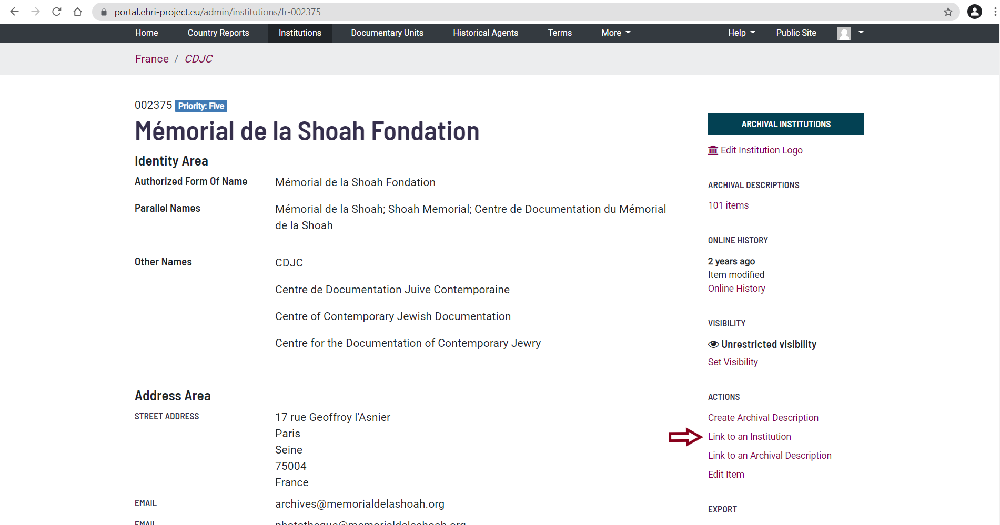
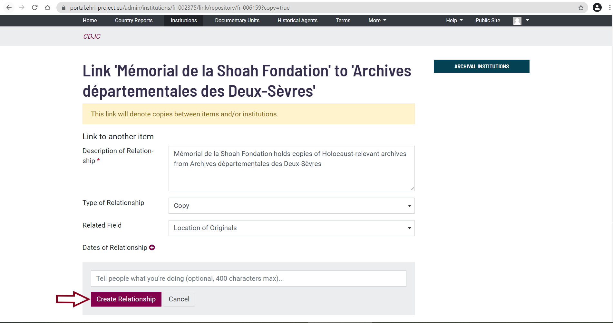
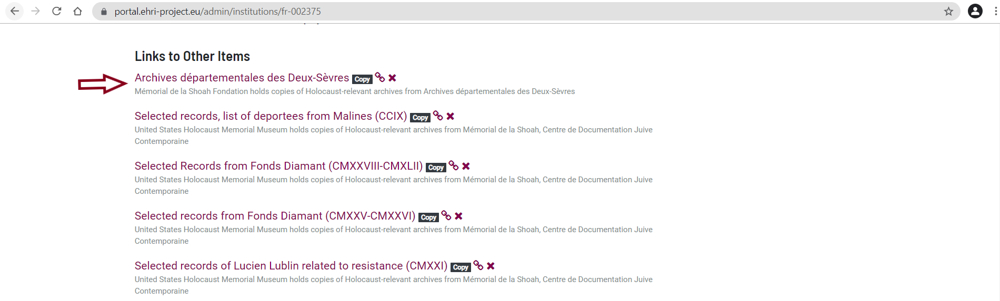
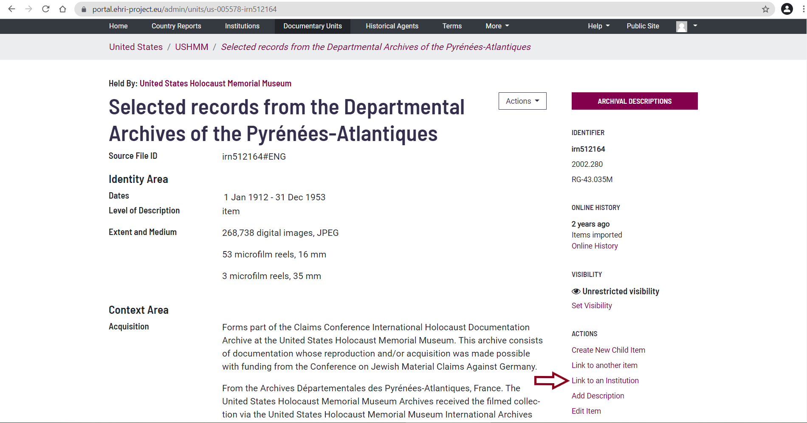
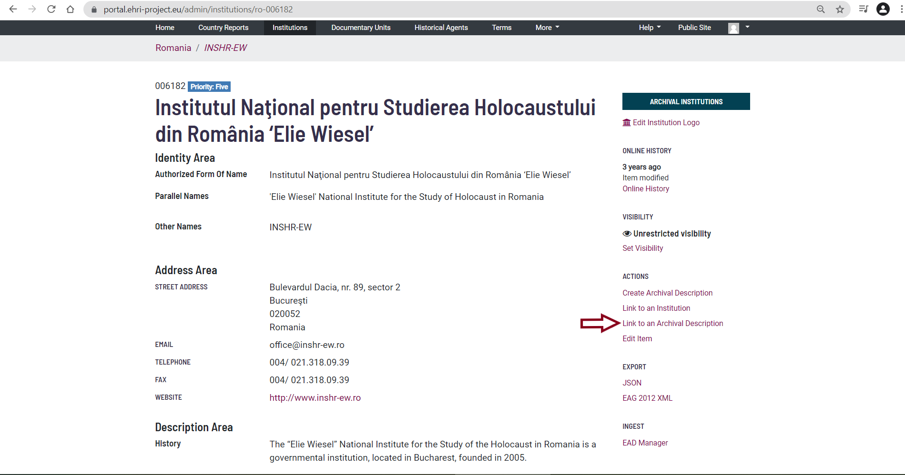
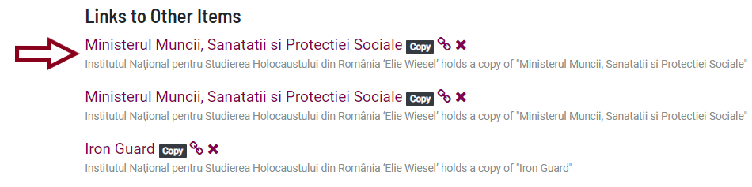

***********************************
How to Create Archival Descriptions
***********************************

Top-level archival descriptions
###############################

Before you start creating a Collection, please make sure you are working
in your Admin profile. A good idea would be to review the information
and tips & tricks described earlier.

Collections are held by archival institutions, therefore you need to go
to the respective archival institution’s page to create an archival
description. For this example, we have decided to work on Italy.

You can find the archival institution either by using the general search
box, by using the search box at ‘Institutions’ (top of the webpage)...

|image30|

… or by using the search box at the ‘Country Report’ page of the
country:

|image31|

Once you have identified the relevant archival institution, you can
create a top-level archival description by clicking on ‘Create Archival
Description’. After which, you will be directed to an editing page.

|image32|

It is **mandatory** to provide:

-  Identifier (call number provided by the archive);
-  Language of description;
-  Title;
-  Date(s);
-  Level of description;
-  Extent and medium;
-  Language(s) of Materials;
-  Script(s) of Materials;
-  Archivist's notes.

**Please note that adding the creator to the archival description
is also mandatory. This, however, can only be done after the archival
description has been created: see below how to add a creator**

It is desirable to provide:

-  Biographical history;
-  Archival history;
-  Scope and content;
-  Finding aids;
-  Existence and location of originals;
-  Existence and location of copies;
-  Publication note.

All the other fields are optional.

If available however, all information can be provided.

|image33|

You can fill out each of the fields by simply clicking on them.
Moreover, if you click on the respective text fields an explanation of
the field function will be displayed. Throughout the page you will
encounter ready-to-fill-in fields and plus-buttons. Once you have
clicked on the plus button, new ready-to-fill-in fields will open.

You can create as many fields with the plus button as you need.

To save your description, click on ‘Create Archival Description’ at the
bottom of the page.

*Tips & tricks: If you receive an error message when trying to save your
description, this may be caused by an open field created by having
clicked on a plus-button. You will need to close the empty field
indicated in red by clicking the* **X** *to the right of the
respective field.*

Child Items
###########

The creation of child items allows you to create a hierarchical
structure in your descriptions.

Child Items are held by a parent archival description, therefore you
first have to go to the parent archival description page to create a
child item description. For this example, we will work on Romania.

|image34|

On the parent archival description page you have to click on ‘Create New
Child Item’. You will be directed to an editing page, with the same
structure as the parent archival description page.

|image35|

Now follow the steps described above under **How to create Archival
Descriptions**.

How to Update Archival Descriptions
###################################

Once an archival description has been created, you can always update it
by going to its entry

in the EHRI Portal and clicking on ‘Edit Item’.

Note: If you want to suggest the deletion of an item, please contact
info@ehri-project.eu\ `. <mailto:info@ehri-project.eu>`__

|image36|

Once you have finished editing, you can save it by clicking on ‘Update
Archival Description’ at the bottom of the page.

|image37|

How to Add Creators to Archival Descriptions
############################################

It is mandatory to add a creator to every archival description. The
creator is the individual, group, or organization that is responsible
for the production, accumulation, or formation of the archival
collection. Creators are saved under ‘Authority sets’.

The first thing to do is to verify whether you can already find the
Creator under ‘Historical Agents’ (top of the page).

Existing creators
~~~~~~~~~~~~~~~~~

If you find the creator you are looking for, go to the archival
description page, and click on Actions > Manage Access Points. The image
below shows the child item ‘Schindler, Oskar’ of the parent item
‘Nachlässe’ held by the Bundesarchiv, Koblenz.

|image39|

Click on ’Add New’ under ’Creator(s)’ and a search box will appear.
Start typing the name you wish to add in the search box. Related terms
will appear underneath the search box.

|image40|

Select the appropriate name and click on it, then click on save.

|image41|

The relationship has been created.

|image42|

New Creators
~~~~~~~~~~~~

If you did not find the creator you were looking for under Historical
Agents, you will need to create it. To do so, go to More > Authority
sets:

|image43|

If you click on the Authority sets button, you will be redirected to the
following page:

|image44|

For creators you create yourself, there are two options:

If the creator is an institution or an organization, click on EHRI
Corporate Bodies.

|image45|

If the creator is a person or family, click on EHRI Personalities.

|image46|

You will be redirected to the respective page. Click on the Create
Authority button.

|image47|

You will be redirected to an editing page.

It is **mandatory** to provide:

-  Identifier (this is automatically generated by the system);
-  Language of description;
-  Authority type;
-  Authorized form of name;
-  Sources.

It is desirable to provide:

-  Parallel names (to provide an English translation of a non-English
   language name of an institution you are describing);
-  Other names (to provide abbreviations, acronyms, historical names and
   other names);
-  History.

|image48|

To create the relationship between the Archival Description and its
Creator you follow the same steps as in the first scenario.

How to link to other/further keywords (names, subject, places and genre)
########################################################################

You have the possibility to add further keywords to your archival
description. Keywords can include names (people, families and corporate
bodies), subjects, places and genre.

In our example, the archive being described is located in Italy.

Go to the archival description to which you wish to add keywords. Go to
Actions > Manage Access Points.

|image49|

Click on Manage Access Points, and you will be redirected to the
following page. We will continue our example by adding a ‘Subject’.
Start typing the Subject you wish to add in the empty text-box:
available values will appear automatically.

There are two options:

Existing keywords
~~~~~~~~~~~~~~~~~

If you find the desired value, in our example ‘Jewish emigration’...

|image50|

Select it, and click on the Save button.

|image51|

Your relationship has been created and is visible at the bottom of the
Archival description page.

|image52|

New keywords
~~~~~~~~~~~~

If you did not find the Subject you were looking for in the pop-up list,
enter it as plain text and

click on the green ‘plus’ button.

|image53|

Then click on the Save button.

|image54|

Your relationship has been created and is visible at the bottom of the
Archival description page.

|image55|

How to create Connections between Originals and Copies
######################################################

In the EHRI Portal we can create links between the archival institutions
which hold the original archival units and the archival institutions
which hold copies of the original archival unit.

Four types of connections between copies and originals can be created:

-  Original archival unit – Copy archival unit;
-  Original archival institution – Copy archival institution;
-  Original archival institution – Copy archival unit;
-  Original archival unit – Copy archival institution.

Before you start creating connections, please make sure you are working
in your Admin profile. A good idea would be to review the information
and tips & tricks described earlier.

Original archival unit – Copy archival unit
~~~~~~~~~~~~~~~~~~~~~~~~~~~~~~~~~~~~~~~~~~~

For our first type of connection we will work on linking an original
archival unit held in Warsaw, Poland with a copy collection held in
Vilnius, Lithuania.

Once you have identified the copy archival unit you want to connect, go
to Actions > Link to another item.

|image56|

Click on the ‘Link to another item’ button. In the opened window, search
for the original archival description with which you want to create a
link. Once you have found it, click on the ‘Create Copy Link’ button:

|image57|

A new page will open. Click on the ‘Create Relationship’ button:

|image58|

|image59|

Your Original archival unit – Copy archival unit was created, and you
can see this at the bottom of the page:

|image60|

Original archival institution – Copy archival institution
~~~~~~~~~~~~~~~~~~~~~~~~~~~~~~~~~~~~~~~~~~~~~~~~~~~~~~~~~

For our second type of connection we will work on linking an Original
archival institution to a Copy archival institution. In our example,
both institutions are located in France.

Once you have identified the copy archival institution you want to
connect, go to Actions > Link to an Institution:

|image61|

Click on the ‘Link to an Institution’ button. In the opened window
search for the Original archival institution with which you want to
perform the linking. Once you have found it, click on the Create copy
link button:

|image62|

A new page will open. Click on the ‘Create Relationship’ button:

|image63|

Your Original archival institution – Copy archival institution link has
been created and is visible at the bottom of the page:

|image64|

Original archival institution – Copy archival unit
~~~~~~~~~~~~~~~~~~~~~~~~~~~~~~~~~~~~~~~~~~~~~~~~~~

For our third type of connection we will work on linking a Copy Archival
Unit located in the USA to an Original archival institution located in
France.

Once you have identified the Copy archival unit you want to connect, go
to Actions > Link to an Institution:

|image65|

Click on the ‘Link to an Institution button’. In the opened window,
search for the Original archival institution with which you wish to
create a link. Once you have found it, click on the ‘Create Copy Link’
button:

|image66|

A new page will open. Click on the ‘Create Relationship’ button:

|image67|

Your Original archival institution - Copy archival unit link has been
created and is visible at the bottom of the page.

|image68|

Original archival unit – Copy archival institution
~~~~~~~~~~~~~~~~~~~~~~~~~~~~~~~~~~~~~~~~~~~~~~~~~~

For our fourth type of connection we will work on linking an original
archival unit to a copy archival institution. In our example, both of
them are located in Romania.

Once you have identified the Copy archival institution you want to link,
go to Actions > Link to an Archival Description:

|image69|

Click on the ‘Link to an Archival Description’ button. In the opened
window, search for the Original archival unit with which you want to
perform the linking. Once you have found it, click on the ‘Create Copy
Link’ button:

|image70|

A new page will open. Click on the ‘Create Relationship’ button:

|image71|

Your Copy archival institution – Original archival unit link has been
created and is visible at the bottom of the page:

|image72|

.. |image50| image:: images/create_description_image50.png

.. |image58| image:: images/create_description_image58.png

.. |image60| image:: images/create_description_image60.png

.. |image62| image:: images/create_description_image62.png

.. |image66| image:: images/create_description_image66.png
.. |image67| image:: images/create_description_image67.png
.. |image68| image:: images/create_description_image68.png

.. |image70| image:: images/create_description_image70.png
.. |image71| image:: images/create_description_image71.png

