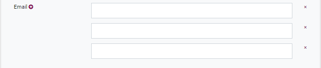

***********************************
How to Create Archival Institutions
***********************************

In order to be able to work in the EHRI portal, you need to receive
access to the admin pages (see :ref:`access`.) This needs to be done by an EHRI project
administrator (please contact by email). Once access has been granted,
you will see the additional words ‘Admin Site’ on the top- right of the
Portal webpage.

|image10|

When you click on “Admin site”, you will be directed to the work
environment of the EHRI Portal.

|image11|

*Tips & tricks: Work in the EHRI Portal, such as adding and editing
content, is only possible through the EHRI Admin site. Therefore, please
make sure you click on the Admin site button. Please ensure that you see
admin written after .eu/ in the browser address line.
https://portal.ehri-project.eu/admin allows you to perform your work in
the portal. Please note that except for when you decide to hide your description via ‘set
visibility’ on the right-hand sight of the page, all your work on the
Admin page will immediately be reflected in the public version of the
EHRI portal. If you are curious to see what your work looks like ‘from
the outside’, just remove admin/ in the browser, e.g.
https://portal.ehri-project.eu/admin/institutions/us-005551. If
your recent changes are not yet visible, please refresh the page. In
order to return to the work environment, simply type admin/ again after
`.eu` and press enter.*

|image12|

Archival institutions can be created only in relation to a specific
country. In order to add a new institution, click on ‘Country Reports’
on the top of the webpage:

|image14|

*Tips & tricks: You can change the way the portal displays items by
clicking on one of the following sorting methods: Relevance, ID/Code,
Name, Recently Updated, Detail. Please feel free to explore all of these
options and choose the one which accommodates your current work best.*

|image15|

Search for the country in which you want to create an archival
institution. In this example, we have decided to work on Belgium.

|image16|

After you click on ‘Search’, you will see the link to the Belgium page,
where you can see the Belgium Country Report, as previously discussed.
Click ‘Create institution’ on the right side of the page under
‘Actions’.

|image17|

*Tips & tricks: In order to quickly move from one country report to
another, just replace the ISO Country Code at the end of the address in
your browser. See the examples below:*

*Belgium:*

|image18|

*Italy:*

|image19|

*Romania:*

|image20|

Once you have clicked on ‘Create institution’, you will be redirected to
a new page with empty fields.

|image21|

You can fill out each of the fields by simply clicking on them.
Moreover, if you click on the respective text field, an explanation of
the field function will be displayed.

|image22|

Throughout the page you will encounter ready-to-fill-in fields, and
plus-buttons **+**.

|image23|

Once you have clicked on the plus button, new ready-to-fill-in fields
will open.

|image24|

You can create as many fields with the plus button as you need.

|image25|

Since 2024, fields which are mandatory and desirable are indicated
via labels like so:

|image_field_hints_repo|

If available however, all information can be provided.

To save your description, click on ‘Create institution’ at the bottom of
the page.

|image26|

*Tips & tricks: If you receive an error-message when trying to save your
description, this may be caused by an open field created by having
clicked on a plus button. You will need to close the empty field
indicated in red by clicking the **X** to the right of the
respective field.*

|image27|

How to update Archival Institutions
###################################

Once an archival institution has been created, you can always update it
by going to its entry

in the EHRI Portal and clicking on ‘Edit Item’.

Note: If you want to suggest the deletion of an institution, please
contact *info@ehri-project.eu*.

|image28|

You will be redirected to an editing page. Once you have finished, you
can save your update by clicking on ‘Update Institution’ at the bottom
of the page.

|image29|

.. |image14| image:: images/create_institution_image14.png

.. |image27| image:: images/create_institution_image27.png
.. |image28| image:: images/create_institution_image28.png

