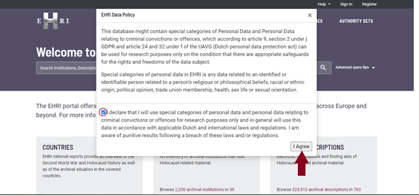
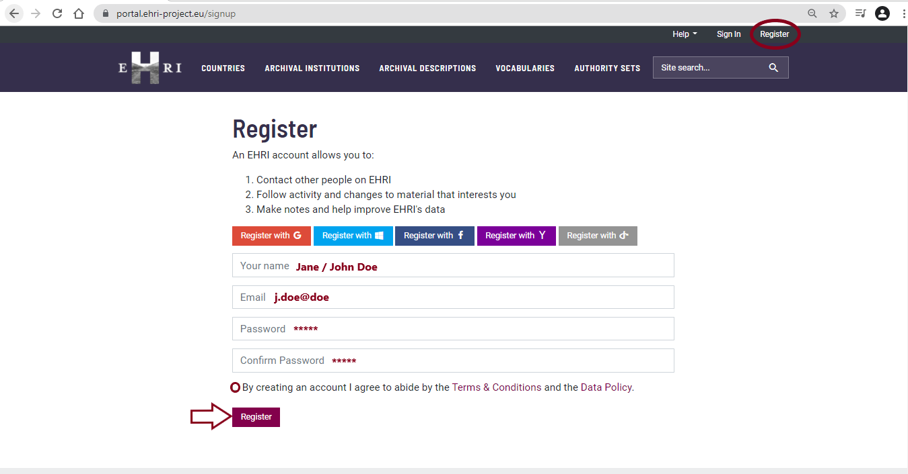
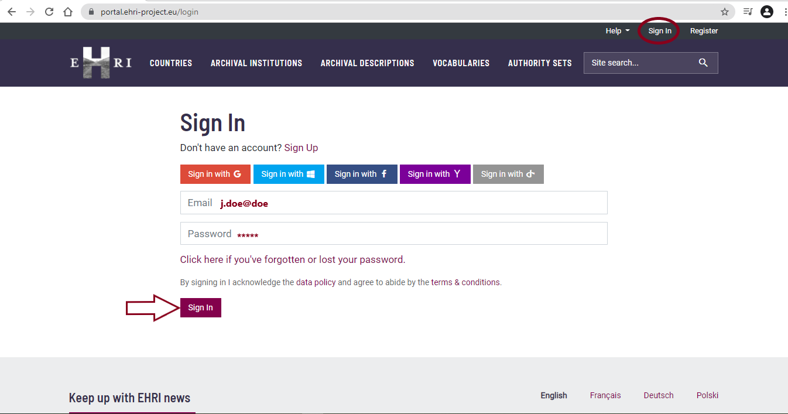
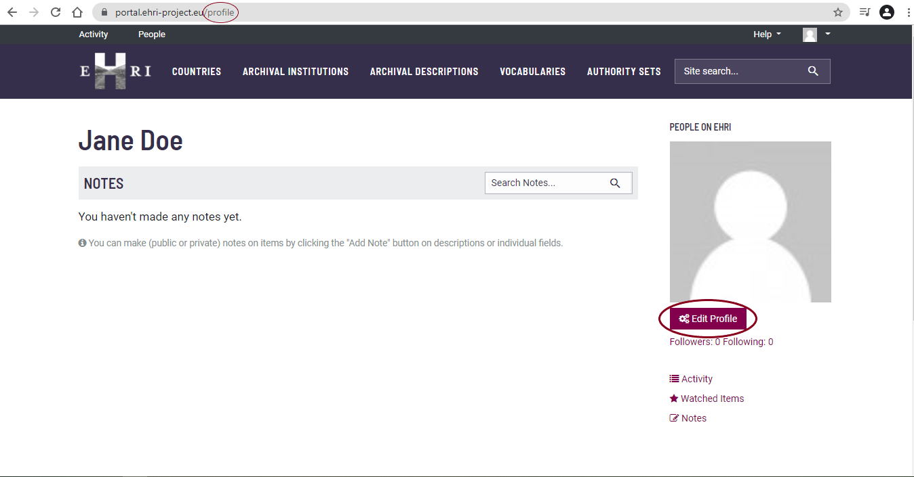

*************************************
Creating a profile on the EHRI portal
*************************************

Before starting, please make sure you have agreed to the *EHRI Data
Policy* by ticking the small box on the left hand side of the window,
and then clicking on "I Agree".

|image1|

Once you have agreed to the *EHRI Data policy*, please click "Register"
(top right), and register for the EHRI Portal by filling in the required
fields below.

Tick the small square to the left of the *Terms & Conditions* at the
bottom of the page and then click the "Register" button.

*Tips & tricks: You can also register with your Google, Windows,
Facebook, Yahoo and OpenID account.*

|image2|

After registering, you will arrive at your "Profile Page" on the EHRI
Portal. You can also sign into the EHRI Portal by clicking on "Sign In"
(top right) and filling in your email & the password you created in the
previous step.

|image3|

Please feel free to use the ‘Edit profile’ button. Beyond building a
digital research infrastructure, the EHRI Project is building a human
network, and we would love to get to know you (including a profile
picture if possible).

|image4|

*Tips & tricks: The EHRI Portal is one of the most important outputs
of the EHRI Project. Therefore, before starting your work, give
yourself a bit of time to explore and to learn more about other people
in EHRI.*

