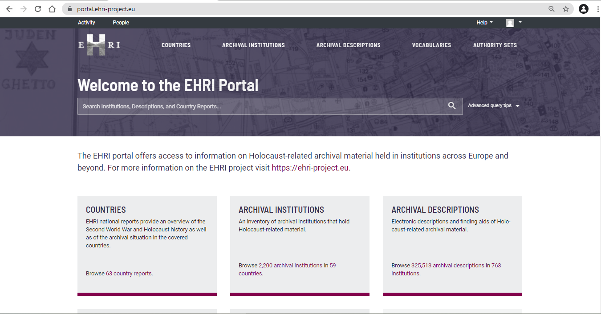
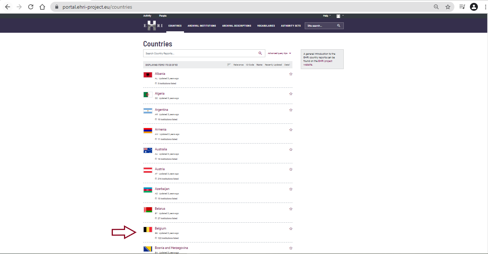
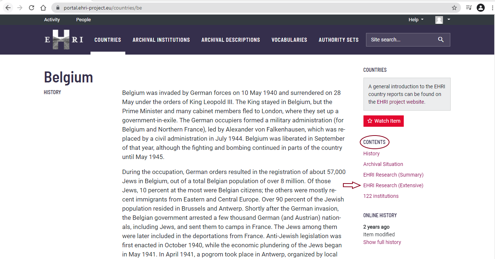
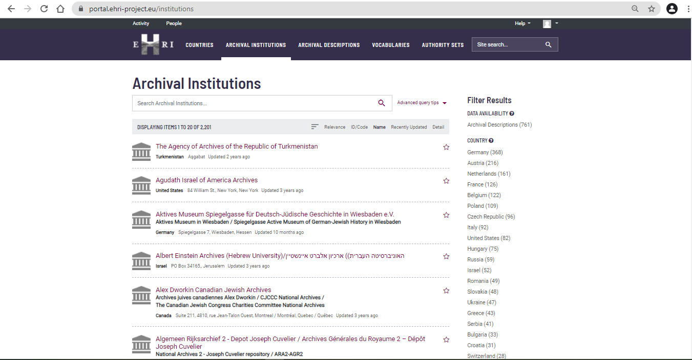
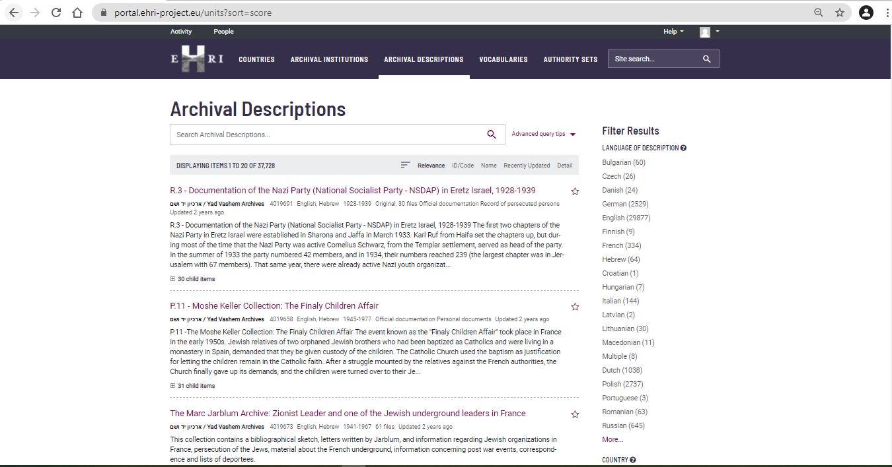

*****************************
First look at the EHRI portal
*****************************

The EHRI Portal is built around three major hierarchical elements:
*Countries*, *Archival Institutions*, and *Archival Descriptions*. For a
short introduction, please see this video and online course
*https://training.ehri-project.eu/unit/7-ehri-portal-manual*.

In the next pages we will explain **How to create Archival institutions,
Archival Descriptions, Authority Records, and Access Points**, but first
here is an additional introduction to the EHRI Portal.

|image5|

Countries
#########

Each country has a dedicated country report. To access this page just
click on the country name:

|image6|

Country reports provide information about the Holocaust
history of and the archival situation in that country, as well as a
summary of EHRI’s research work conducted on the respective country so
far and an extensive report of that work. For more information about the
structure, length and purpose of the country reports, please read the
`introduction to the country reports on the EHRI website
<https://www.ehri-project.eu/country-reports>`_.

Below the country report, there is a search box for archival
institutions situated within this country, as well as a possibility to
browse archival institutions in this country. You can further explore
the archival descriptions within these archival institutions.

*Tips & tricks: We recommend you read all the information listed in the
country report. However, if you are just interested in a specific
section of a country report, click on the section’s name under
"Contents".*

|image7|

Archival Institutions
#####################

The EHRI Portal provides information on archival institutions which hold
Holocaust-related archival material.

One can find archival institutions using the general search box, search
or browse the archival institutions under *archival institutions* or
access them via the search function underneath the country reports.

Archival Descriptions
#####################

The EHRI Portal provides Holocaust-related archival descriptions.

Archival descriptions can be searched through the general search box,
searched or browsed via *archival descriptions* or, if an archival
institution has archival descriptions of its holdings on the EHRI
Portal, these can be searched or browsed below the description of the
particular archive on its archival institution entry page in the EHRI
Portal.

|image9|

