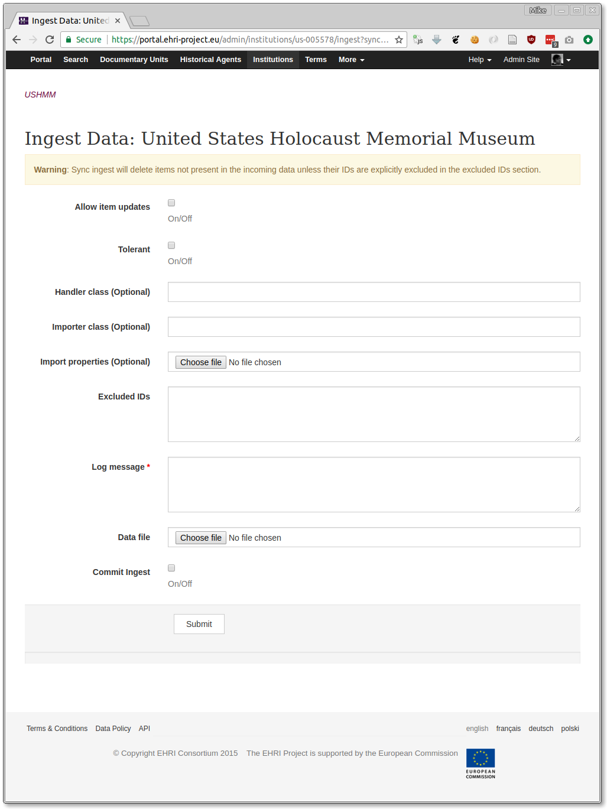

EAD Ingest
==========

.. role:: alert-danger
:alert-danger:`Note: this method of importing EAD is deprecated in favour of using the` `EAD Manager <institution-data.html>`__.

EHRI administrators can ingest EAD into the portal via a web interface. Behind the scenes the process is the same as
that documented in the `backend ingest section <../technical/backend/ingest.html>`_ but using the web interface does
more, as described below.

First, you need to **find the item you're importing into**. This is known as the *scope* in EHRI lingo. For example, 
institutions and top-level archival units are both valid scopes for EAD import. There are two modes for EAD ingest:

Standard
  The usual EAD ingest mode which will create new items or update existing items.

Sync Mode
  This will synchronise the contents of the repository or archival unit to match the data being ingested. Obviously
  **this is a sharp tool** since it will delete existing items from the DB unless they're present in the EAD you're
  importing. Sync mode will also detect items that have moved from one place in the archival hierarchy to another (e.g.
  via the insertion of intermediate organisational levels) and repoint user-generated content referring to the old
  items, and creates 301 (moved permanently) redirects for the old items.

**Note**: when ingesting into a top-level archival unit, sync mode is the only one available, and also depends on the
archive in question having unique identifiers for each archival unit. If they don't, it's not possible to safely perform
the ingest.

One the ingest scope page you'll see this section of the sidebar:

.. image:: images/ingest-links.png
    :alt: Link to ingest EAD

That will lead to the following form:

The options on this form are as follows:

Allow Item Updates
  Checking this box shows intent that the data to be ingested could update items already in the database.

Tolerant
  This will prevent the ingest task aborting if there are individial validation errors during the process. Leave this
  unchecked unless you really know what the validation errors are and that they can be safely ignored.

Handler Class
  If a custom XML handler has been written for this data, specify its class name here.

Importer Class
  If a custom XML importer has been written for this data, specify its class name here.

Import Properties
  If this data requires custom property mappings, attach the properties file here.

Excluded IDs
  If a scope is being synchronised by you want to exclude some specific items (for example, items that were created
  manually and not derived from EAD) specify the item IDs to be excluded here, one per line.

Log Message
  A mandatory message providing the context of this data import (where the data came from, etc.)

Data File
  The actual EAD payload, consisting of *either* a single EAD XML file *or* a GZipped archive containing multiple EADs.

Commit Ingest
  Without this box checked the importer will work in dry-run mode, and not actually commit any changes to the database.
  This is very useful if you want to validate its behaviour, and at least one dry-run should be made.

On clicking submit the payload file will upload and in due course you should start to see some progress messages appear,
like the following:

::

  Finished uploading data...
  Initialising ingest for job: 5124c9ae-4f2a-4db3-bf3c-2cdffcdc8fc0...
  Ingesting... |
  Ingesting... /
  Ingesting... -
  Ingesting... \
  Ingesting... |
  Received a valid sync manifest...
  Data: created: 12338, updated: 30698, unchanged: 0, errors: 0
  Task was a dry run so not proceeding to reindex
  Uploading log...
  Ingesting... /
  Sync: moved: 456, new: 11882, deleted: 2371
  Task was a dry run so not creating redirects
  Log stored at https://s3-eu-west-1.amazonaws.com/ehri-data/ingest-logs%2Fingest-20180208150649-5124c9ae-4f2a-4db3-bf3c-2cdffcdc8fc0.json
  Done

Dry run mode will store a log for you to examine, but will not create 301 redirects if any items were moved in the sync
process.

