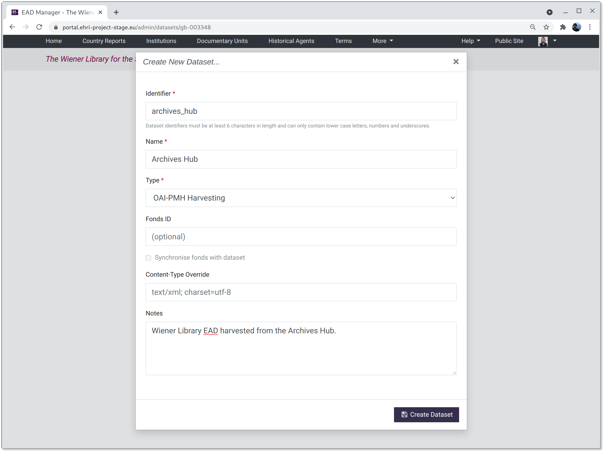
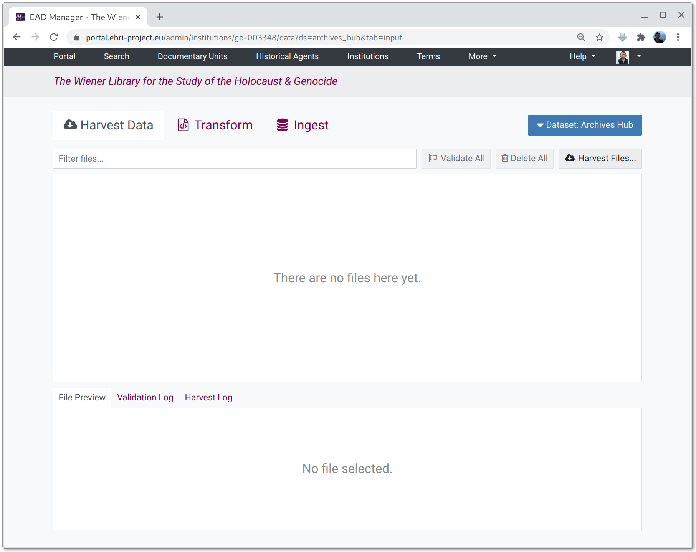
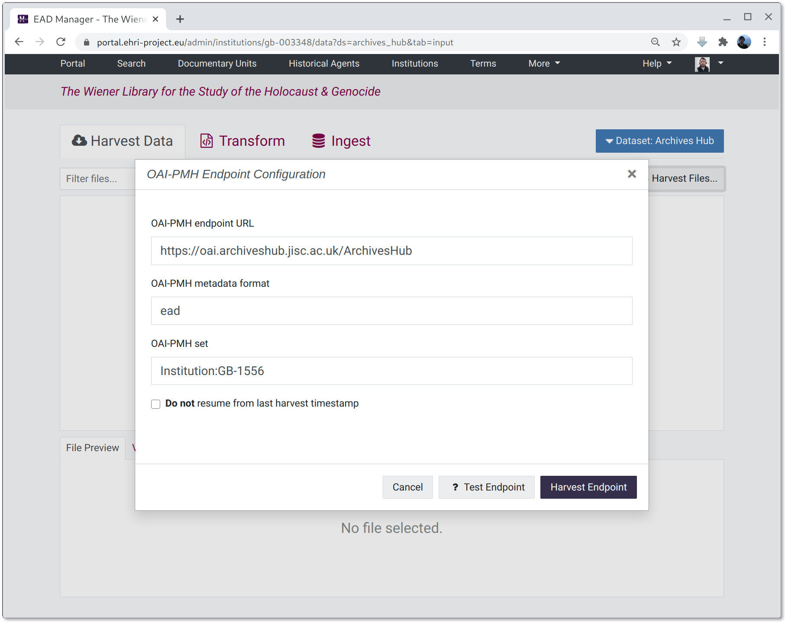
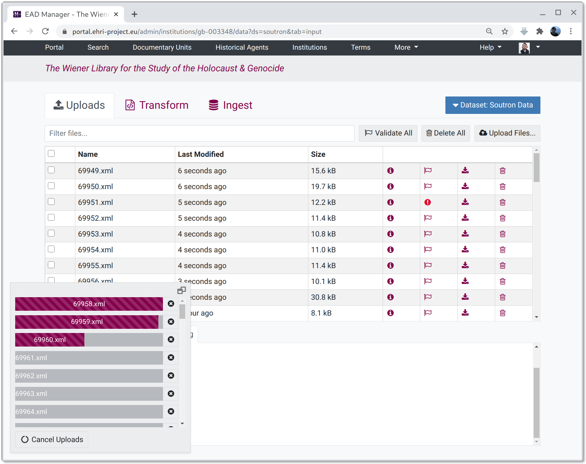
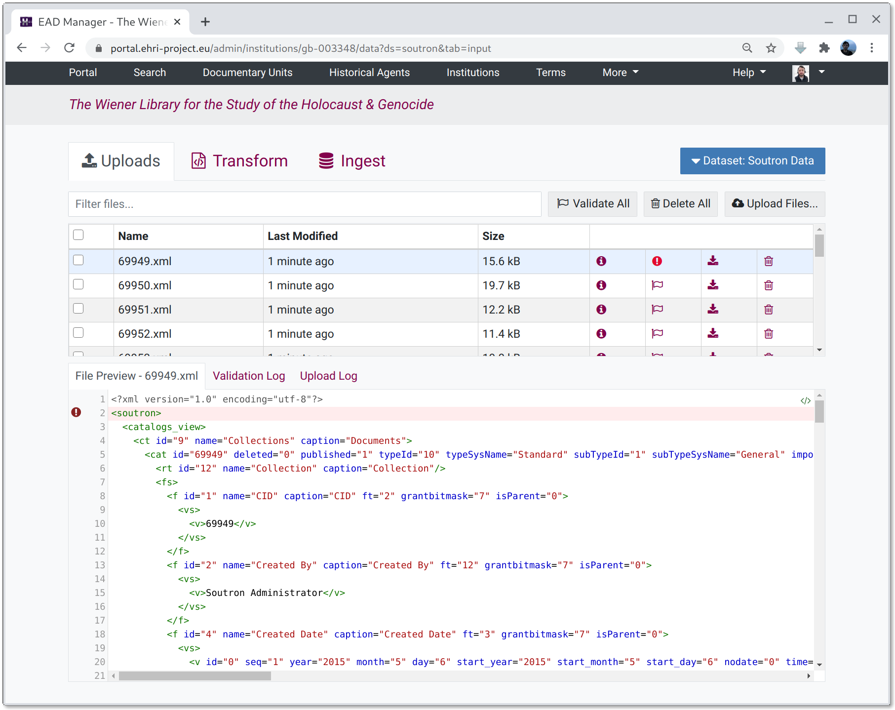
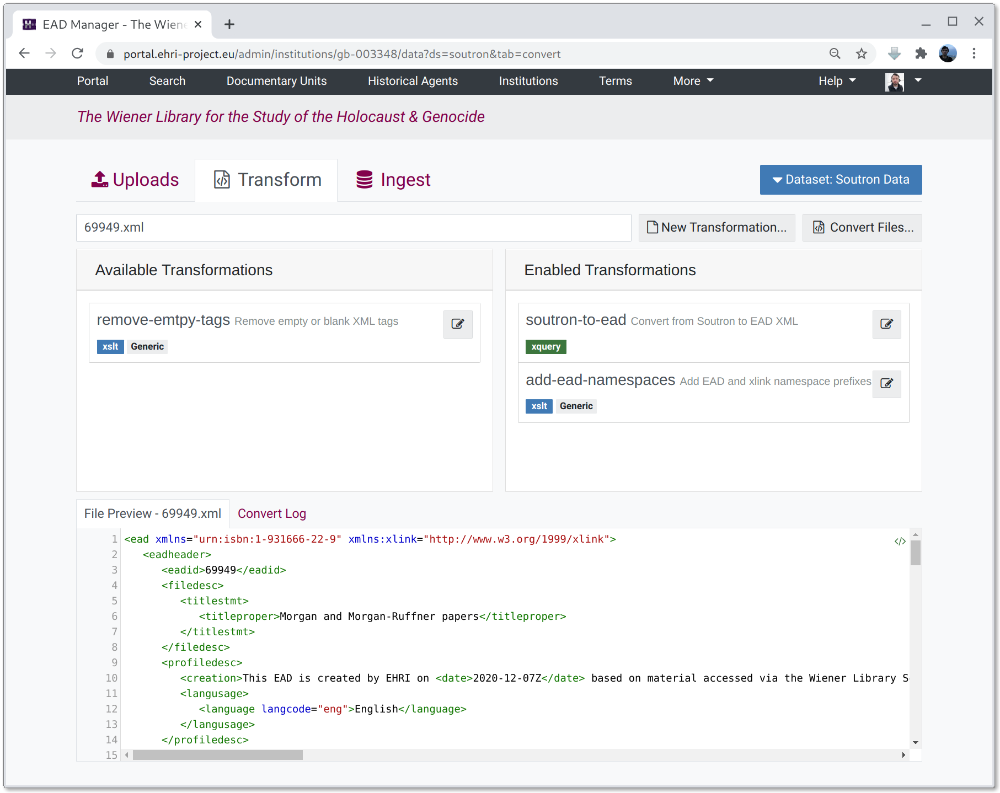

=====================
Institution File Data
=====================

Important Note: This documentation refers to functionality in a very early stage of development and is likely to be outdated or inaccurate!
###########################################################################################################################################

Introduction
============

This documentation describes EHRI's tools for managing, transforming and ingesting XML collection descriptions. In a
nutshell, it allows administrators to:

* manually upload XML files
* configure harvesting of files from OAI-PMH endpoints
* validate XML against EHRI's EAD schema
* transform arbitrary XML to EAD using either XSLT or tabular XQuery mappings
* ingest the resulting EAD into the EHRI portal

Overview of the Data Management UI
==================================

The first thing to do when visiting the Institution Data Management page is to create a new dataset. A dataset is a *set
of XML files that come from the same place and are processed in the same way*. Although an institution could just have
one dataset representing its files, there are several reasons why multiple datasets might be more appropriate:

* there are a large number of files, for example, over 1,000. Large batches can take a long time to process or to ingest
  into the portal so it is good practice to split them up info more managable chunks numbering, say, at most a few
  hundred files apiece (or fewer if the files themselves are very large.)
* the files arrive in different batches at different times.
* the files represent distinct parts of an institutions holdings.
* the files require processing in a different way.
* the files come from a different source, e.g. one set is harvested via OAI-PMH and another uploaded manually.

A new dataset requires an identifier that can only consist of lower-case characters, numbers and underscores. Except for
these restrictions it is arbitrary, but **cannot be changed later.**

The dataset name is also arbirary but can be changed later, as can the type. Notes can be used to detail the source of
the files for future reference.

Once a new dataset has been created the dataset UI is shown.

The dataset UI has three tabs:

Tab 1: Harvested Data or Uploads (depending on the dataset type)
  The first tab shows an (initially empty) list of input files, either harvested or uploaded manually.

Tab 2: Transformation
  Where XSLT or XPath transformations can be managed, created and applied to either harvested or uploaded files.

Tab 3: Ingest
  Where the results of transformations can be ingested into the portal.

Harvesting
==========

At present the source tab, for harvesting datasets, only supports harvesting files via the OAI-PMH protocol. To do so, click on the "Harvest Files..." button and fill in the three fields required to describe the endpoint. These are:

OAI-PMH endpoint URL
  The address of the OAI-PMH server, without any parameters.

OAI-PMH metadata format
  The metadata format of the files to fetch, for example "ead" or "oai_dc".

OAI-PMH set
  An *optional* set specification, if required.

Clicking the "Test Endpoint" button with the parameters provided will check the endpoint exists and supports
the right data formats etc. Then, clicking the "Harvest Endpoint" button will attempt to fetch the files.

Fetched files are displayed in a table and can be previewed, validated, deleted or downloaded.

Uploading
=========

For upload datasets the source tab shows an "Upload Files..." button. You can also drag-and-drop files onto the list
pane to upload them to the system.

Previewing Files
================

When clicking on an item in the file list the contents will be shown in the preview pane. Note: large files will be
truncated. The preview will automatically validate the file's contents against EHRI's EAD schema and errors will be
shown along with the contents.

Transformation
==============

The transformations tab lists the set of available transformations. A "conversion pipeline" can be configured
by dragging zero or more transformations from the available set, which will then be applied in serial, with the
output from one operation being the input to the next. If a file is selected from the preview list the preview 
window in the bottom pane will display the result of the enabled transformations or, if no transformations are active, the 
selected file unchanged.

Once a set of transformations has been enabled it can be run on the contents of either the Harvest or Upload stages by
clicking the "Convert Files..." button and selecting one or both stages as an input.

Note: if the source files do not require any transformation the convert button will simply copy them to the ingest
workspace unchanged.

Editing transformations or creating new ones
============================================

.. image:: images/data-management-edit-transformation.png
    :alt: The data management transformation editor

Clicking the edit button on a transformation opens the transformation editor. This consists of three panes:

The top pane
  This is where the XSLT or XQuery mapping list can be edited

Bottom left pane
  This shows the input file selected from the preview list

Bottom right pane
  This shows the input file with the transformation applied

Once a transformation has been edited to your satisfaction the Save button will update it.

XSLT
....

XSLT transformations must be complete XSLT 2.0 stylesheets, and are best suited to making small changes to
documents. A minimal example that adds the EAD namespace attribute value ``urn:isbn:1=931666`` would be::

    <xsl:stylesheet version="2.0" xmlns:xsl="http://www.w3.org/1999/XSL/Transform">
        <xsl:output indent="yes"/>

        <xsl:template match="@*|node()">
            <xsl:copy>
                <xsl:apply-templates select="@*|node()"/>
            </xsl:copy>
        </xsl:template>

        <xsl:template match="*" priority="1">
            <xsl:element name="{local-name()}" namespace="urn:isbn:1-931666-22-9">
                <xsl:namespace name="xlink" select="'http://www.w3.org/1999/xlink'"/>
                <xsl:apply-templates select="@*|node()"/>
            </xsl:element>
        </xsl:template>

    </xsl:stylesheet>

XQuery Mappings
...............

XQuery transformations consist of a list of mappings from the source document to the transformed output. They are best
suited to building completely new EAD documents from arbitrary input XML. Each mapping consists of four fields:

target-path
  an XPath specifying where to create a node

target-node
  the local name or, when prefixed by the ``@`` symbol, attribute name to create within the target-path

source-node
  an XPath expression pointing to a node within the source document

value
  an XPath expression giving the value of the target node, given the source node as context. For example,
  the expression ``text()`` would return the text value of the source node, whereas a quoted string such
  as ``"Some text"`` would give a literal value.

Documents should be built by adding mappings in hierarchical order.

**TIPS:**

To paste a complete set of XQuery mappings from tab-separated values, switch the editor to XSLT mode, paste
the TSV (including headers) and then switch back to XQuery mode. If the TSV was well formed things should look
as expected.

Ingest
======

.. image:: images/data-management-ingest.png
    :alt: The data management ingest tab

The ingest tab shows the files resulting from applying zero or more transformations to the harvest or upload
file stages. Here, once again, files can be previewed, validated, deleted or downloaded.

Clicking the "Ingest Files..." button will open the ingest parameters window to import data into the portal.

