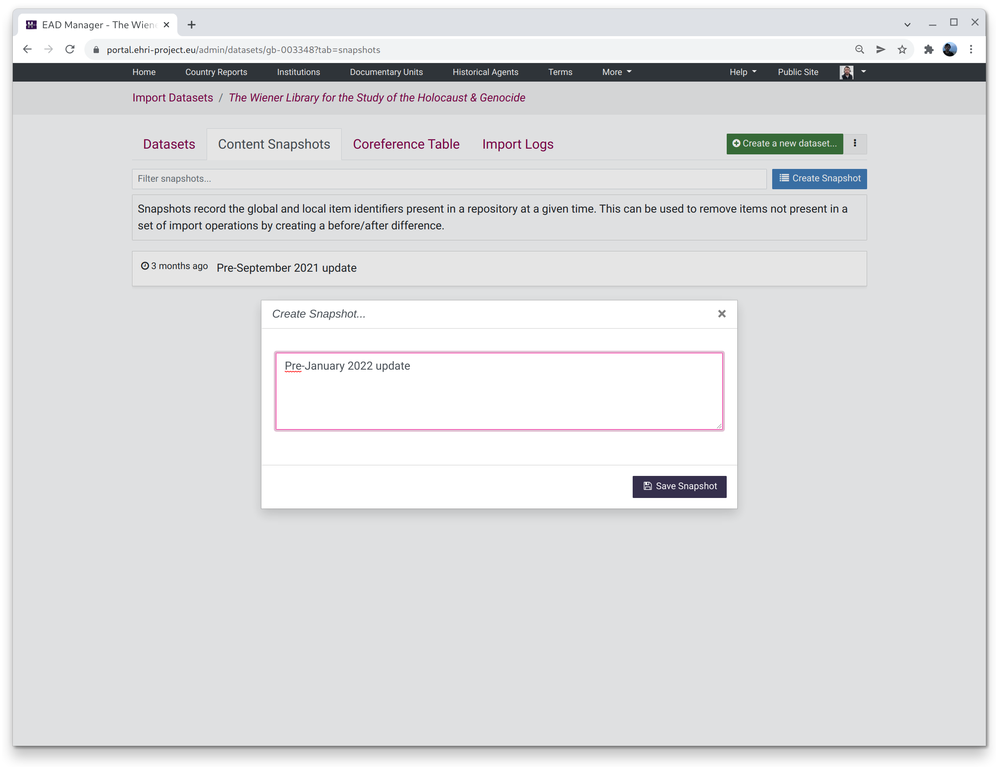

*****************
Content Snapshots
*****************

.. role:: alert-danger

Content snapshots assist with synchronising data with a remote source, typically another archival institution.
While mechanisms for communicating removal of previously-existing material does exist in protocols such as OAI-PMH or ResourceSync,
these are often unsupported in practice, and for non-harvested data these are obviously no help. Snapshots allow comparing the
state of the data in the EHRI portal belonging to an institution before and after a set of import operations and can automatically
suggest cleanup actions based on the results.

**Snapshot cleanup is dangerous and should only be used with manual verification of the actions to be performed!**

A content snapshot is essentially a list of portal identifiers and their corresponding local (indigenous) identifiers for all the
material held by a given institution at a point in time:

.. list-table:: Content Snapshot example
   :widths: 50 50
   :header-rows: 1

   * - Portal identifier
     - Local identifier
   * - gb-003348-1
     - 1
   * - gb-003348-2
     - 2
   * - ...
     - ...
   * - gb-003348-500
     - 500

The idea is to take a snapshot, perform a sequence of import operations that span the full range of material in an institution, and
then compare the *before* and *after* states to determine what needs to be deleted or where redirects need to be created for items that
have moved.

Creating a snapshot
===================

To create a new snapshot simply click the `Create Snapshot` button and provide a brief description. The description might state that
the snapshot is prior to a particular set of imports about to be done.

Selecting a snapshot
====================

Selecting a snapshot from the list allows you to perform cleanup actions.

**Note:** :alert-danger:`this is dangerous!`

Cleanup consists of:

* Creation of redirects for moved items
* Deletion of defunct items

Detection of moved items will *only* be accurate of an institution has **fully unique local identifiers**, i.e. identifiers that only occur
once within the full span of an institutions holdings, and are not re-used for items that exist within different collections. If this is **not**
the case then detection of moved items will likely give inaccurate or misleading results.

Defunct items are assumed to be those which have *not been imported since the creation of the snapshot*. If any items are manually managed, or
created by datasets not yet imported, :alert-danger:`these will be wrongly suggested for deletion`.

**Summary**: don't use cleanup without manually sanity-checking the actions it suggests.