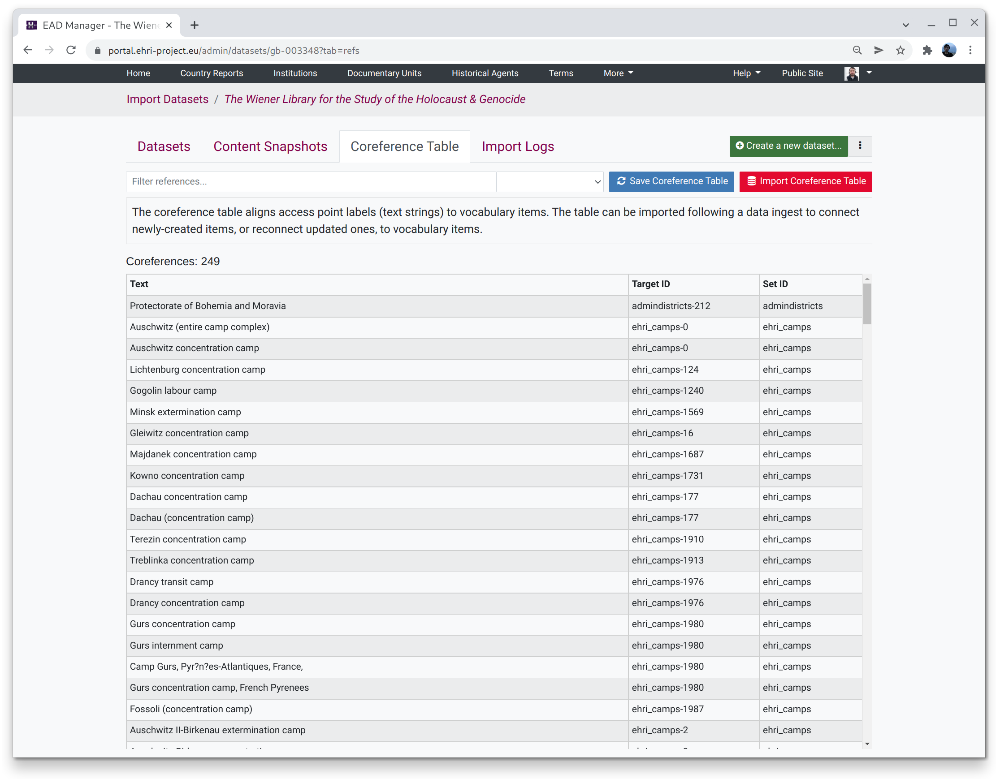

*****************
Coreference Table
*****************

When we import material from third-party institutions it is not normally the case that their index terms
(or "access points": people, places, subjects, etc) are the same as — or align with — EHRI's controlled vocabularies.
As a result, when we import an EAD file the list of index terms in the archival descriptions are typically not clickable,
because we don't know that the terms actually refer to an authoritative term in the EHRI portal.

Because non-navigable index terms aren't very useful (except for search indexing) EHRI has in the past manually created links
between a particular text phrase that an institution uses, for example "Hans Adler", and a record in the EHRI portal, in
this case the person authority record `Hans Adler <https://portal.ehri-project.eu/authorities/ehri_pers-000003>`_.

In specific terms this means that for data from institution X the index term string Y refers to EHRI portal entity Z. For
each institution we therefore end up with a table that looks like this:

.. list-table:: Coreference table example
   :widths: 50 50
   :header-rows: 1

   * - Index term text
     - EHRI entity ID
   * - Jewish Refugees Committee
     - ehri_terms-101
   * - Socialism
     - ehri_terms-1010
   * - ...
     - ...
   * - Propaganda
     - ehri_terms-986

Making these connections is one thing but they do not, currently, get automatically applied whenever **new** material
is imported from a particular institution. For now, when we import or updated material we have to save the coreference
table beforehand and *re-apply* it after import to ensure that new instances of terms for which we have a connection end up with
a clickable link as well. This process may get more automated in future.

There are currently two buttons:

Save Coreference Table
  Analyses access points for existing items belonging to the current institution and records any references to EHRI entities. This
  should be run **prior** to an import but is safe to run at any time since it will not result in duplicate entries being added to the
  table.

Import Coreference Table
  Finds unconnected access points that are in the coreference table and connects them to the relevant EHRI entity. This should be
  run **after** an import but is also safe to run at any time since it will not create duplicate links.

