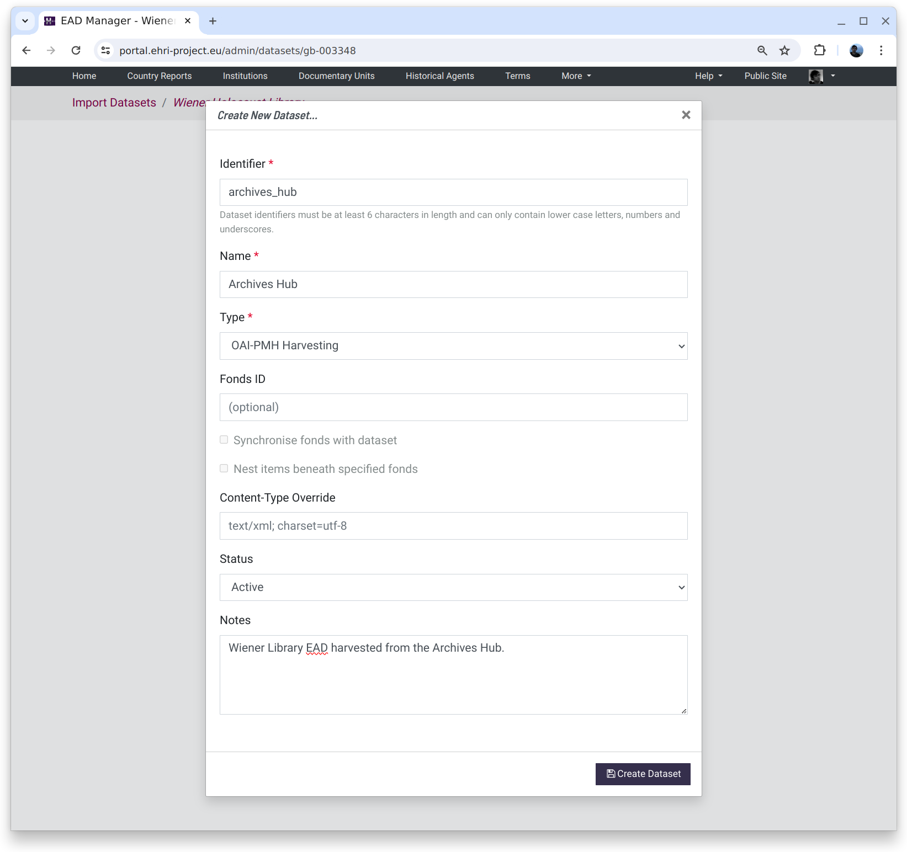

********
Datasets
********

The first thing to do when visiting the EAD Manager is to create a new dataset. A dataset is a *set
of XML files that come from the same place and are processed in the same way*. Although an institution could just have
one dataset representing its files, there are several reasons why multiple datasets might be more appropriate:

* there are a large number of files, for example, over 1,000. Large batches can take a long time to process or to ingest
  into the portal so it is good practice to split them up info more manageable chunks numbering, say, at most a few
  hundred files apiece (or fewer if the files themselves are very large.)
* the files arrive in different batches at different times.
* the files represent distinct parts of an institutions holdings.
* the files require processing in a different way.
* the files come from a different source, e.g. one set is harvested via OAI-PMH and another uploaded manually.

A new dataset requires an identifier that can only consist of lower-case characters, numbers and underscores. Except for
these restrictions it is arbitrary, but **cannot be changed later.**

The dataset name is also arbitrary but can be changed later, as can the type. Notes can be used to detail the source of
the files for future reference.

The dataset type sets where the input files come from:

Uploads
    The files will be uploaded by the user from their local computer

OAI-PMH
    The files will be harvested from an `OAI-PMH <https://www.openarchives.org/pmh/>`__ endpoint

ResourceSync
    The files will be downloaded via an `OAI ResourceSync <http://www.openarchives.org/rs/toc>`__ capability list URL

URL Set
    The files will be downloaded from a set of URLs mapped to predetermined file names

There are some other parameters on the dataset form that can normally be left alone:

Fonds ID
  This tells the importer that the dataset should be imported into one specific top-level documentary unit
  rather than the institution. Typically this would be used with datasets consisting of a single EAD.

Synchronise fonds with dataset
  In conjunction with the fonds ID, this tells the importer to remove any documentary units not represented
  in the import set and attempt to synchronise any user-generated data. This would typically be used when a
  fonds has undergone a large reorganisation necessitating the removal of many units. Synchronisation only
  works when an institution has unique identifiers that are consistent before and after import.

Content-Type Override
  By default it is assumed that datasets are XML data with a UTF-8 character set, or "text/xml; charset=utf-8"
  in internet media-type parlance.
  When dealing with a dataset that is not encoded as UTF-8 however a valid internet media type value can be
  used instead, e.g. "text/xml; charset=iso-8859-1". UTF-8 is preferred since it handles a much wider range of
  characters. Encoding issues usually reveal themselves as non-ASCII characters with diacritics such as umlauts
  being garbled.

Status
  By default datasets are active, meaning they contain live data, but they can also be put on hold or inactive to
  communicate that action is deferred or that the data exists for historical reference only.

Notes
  Notes can be used to add any other relevant information about the dataset contents.

The dataset view
~~~~~~~~~~~~~~~~

Once a new dataset has been created the dataset UI is shown.

.. image:: images/data-management-overview.png
    :alt: The dataset UI

The dataset UI has three tabs:

Tab 1: Inputs: Harvested Data or Uploads (depending on the dataset type)
  The first tab shows an (initially empty) list of input files, either harvested or uploaded manually.

Tab 2: Transformation
  Where XSLT or XPath transformations can be managed, created and applied to either harvested or uploaded files.

Tab 3: Ingest
  An (initially-empty) list of files generated by applying transformations to the input files. These would typically
  be valid EHRI-profile EAD XML which can be ingested into the portal database.

The Inputs
==========

The input tab shows a list of "raw", untransformed input files.

.. image:: images/data-management-preview.png
    :alt: Previewing a source file

When clicking on an item in the file list the contents will be shown in the preview pane. Note: large files will be
truncated. The preview will automatically validate the file's contents against EHRI's EAD schema and errors will be
shown along with the contents.

How files get into the inputs tab depends on the type of dataset you selected:

Uploading Files
---------------

.. image:: images/data-management-upload.png
    :alt: The data management upload tab

For upload datasets the source tab shows an "Upload Files..." button. You can also drag-and-drop files onto the list
pane to upload them to the system.

OAI-PMH Harvesting
------------------

.. image:: images/data-management-harvesting.png
    :alt: The data management input tab for an OAI-PMH dataset

To harvest files via OAI-PMH click on the "Harvest Files..." button and fill in the three fields required to describe the endpoint. These are:

OAI-PMH endpoint URL
  The address of the OAI-PMH server, without any parameters.

OAI-PMH metadata format
  The metadata format of the files to fetch, for example "ead" or "oai_dc".

OAI-PMH set
  An *optional* set specification, if required.

Clicking the "Test Endpoint" button with the parameters provided will check the endpoint exists and supports
the right data formats etc. Then, clicking the "Harvest Endpoint" button will attempt to fetch the files.

Fetched files are displayed in a table and can be previewed, validated, deleted or downloaded.

ResourceSync
------------

At present, fetching files via ResourceSync requires knowing the URL of the *capabilitylist.xml* document that, in turn, contains links to the actual file URLs. It is not sufficient to put the URL of the general ResourceSync directory containing the root sitemap (this might be changed in future.) 

To obtain files via ResourceSync click on the "Sync Files..." button and put in the URL of the *capabilitylist.xml*. To
perform selective syncing via the files' paths you can also add a regular expression filter. If the filter is present
it's URL must match to be included in the sync.

Clicking the "Test Endpoint" button with the parameters provided will check the endpoint exists and supports
the right data formats etc. Then, clicking the "Sync Endpoint" button will attempt to fetch the files.

URL Set
-------

While it is not particularly "automatic", it is necessary sometimes to download data from a set of predetermined
online locations. In this case, it is possible to use a table in which individual URLs can be corresponded to a
particular file name when downloaded.

There are additional options for setting HTTP Basic Authentication and the headers to use when downloading files,
e.g. for HTTP Content Negotiation.

Like other methods, clicking the "Test Endpoint" button with the parameters provided will check the validity of 
the provided URLs. Then, clicking the "Sync Downloads" button will attempt to fetch the files.

Data Transformation or Enhancement
==================================

.. image:: images/data-management-transformations.png
    :alt: The data management transformation tab

The transformations tab lists the set of available transformations. A "conversion pipeline" can be configured
by dragging zero or more transformations from the available set, which will then be applied serially, with the
output from one operation being the input to the next. If a file is selected from the preview list the preview 
window in the bottom pane will display the result of the enabled transformations or, if no transformations are active, the 
selected file unchanged.

Once a set of transformations has been enabled it can be run on the contents of either the Harvest or Upload stages by
clicking the "Convert Files..." button and selecting one or both stages as an input.

Note: if the source files do not require any transformation the convert button will simply copy them to the ingest
workspace unchanged.

.. _transformation:

Editing transformations or creating new ones
============================================

.. image:: images/data-management-edit-transformation.png
    :alt: The data management transformation editor

Clicking the edit button on a transformation opens the transformation editor. This consists of three panes:

The top pane
  This is where the XSLT or XQuery mapping list can be edited

Bottom left pane
  This shows the input file selected from the preview list

Bottom right pane
  This shows the input file with the transformation applied

Once a transformation has been edited to your satisfaction the Save button will update it.

.. _xslt:

XSLT
----

XSLT transformations must be complete XSLT 2.0 stylesheets, and are best suited to making small changes to
documents. A minimal example that adds the EAD namespace attribute value ``urn:isbn:1=931666`` would be:

.. code-block:: xml

    <xsl:stylesheet version="2.0" xmlns:xsl="http://www.w3.org/1999/XSL/Transform">
        <xsl:output indent="yes"/>

        <xsl:template match="@*|node()">
            <xsl:copy>
                <xsl:apply-templates select="@*|node()"/>
            </xsl:copy>
        </xsl:template>

        <xsl:template match="*" priority="1">
            <xsl:element name="{local-name()}" namespace="urn:isbn:1-931666-22-9">
                <xsl:namespace name="xlink" select="'http://www.w3.org/1999/xlink'"/>
                <xsl:apply-templates select="@*|node()"/>
            </xsl:element>
        </xsl:template>

    </xsl:stylesheet>

XQuery Mappings
---------------

XQuery transformations consist of a list of mappings from the source document to the transformed output. They are best
suited to building completely new EAD documents from arbitrary input XML. 

See the `XQuery Mapping documentation <xquery-mappings.html>`__ for more details.

**TIPS:**

To paste a complete set of XQuery mappings from tab-separated values, switch the editor to XSLT mode, paste
the TSV (including headers) and then switch back to XQuery mode. If the TSV was well formed things should look
as expected.

Transformation Parameters
-------------------------

If a transformation has the ``parameters`` field checked it means that a set of values will be provided to the
transformer at conversion time. For example, if an XSLT script includes the following parameter:

.. code-block:: xml

    <xsl:param name="some-param" select="'some-value'" />

This parameter can be set for a given dataset by providing a JSON dictionary that includes a field named ``some-param``
with a string value (though values don't have to be strings: ``xsd:number`` and ``xsd:boolean`` are also supported.) For
example, to set the value to "``another-value``" provide the following JSON:

.. code-block:: json

    {
        "some-param": "another-value"
    }

**Why JSON?** The conversion API uses JSON so sending parameters as JSON provides a
way to ensure their format is valid. JSON also provides a succinct way of typing scalar values like strings, number and
booleans.

Transformation parameters work differently for XQuery mappings where they instead provide the ability to let the
interpreter know about additional XML namespace prefixes that are in use in the source document.

Ingest
======

.. image:: images/data-management-ingest.png
    :alt: The data management ingest tab

The ingest tab shows the files resulting from applying zero or more transformations to the harvest or upload
file stages. Here, once again, files can be previewed, validated, deleted or downloaded.

Clicking the "Ingest Files..." button will open the ingest parameters window to import data into the portal.
These parameters currently consist of:

Allow updates
  check this option if you expect the ingested EAD to modify existing database items. If left unchecked
  the import will report an error if an item is updated.
Tolerant
  allows individual files in a batch to have validation errors without the whole batch failing.
Use source file ID
  if checked an EAD will only update an existing
  description if *both* the language and source file ID (derived from the EAD ID) match. This
  provides the ability to import multiple descriptions in the same language, providing the source file ID differs. The
  default behaviour is to update existing descriptions that match the language of the files being ingested and ignore the
  source file ID.
Properties File
  this allows uploading a properties file which can control how EAD fields map to portal internal
  database fields. **This should only be used for compatibility with legacy data.**
Log message
  a log message to be associated with the ingest operation.
Commit
  actually commits the changes to the database. If left unchecked (the default) the ingest is effectively a
  dry-run.

