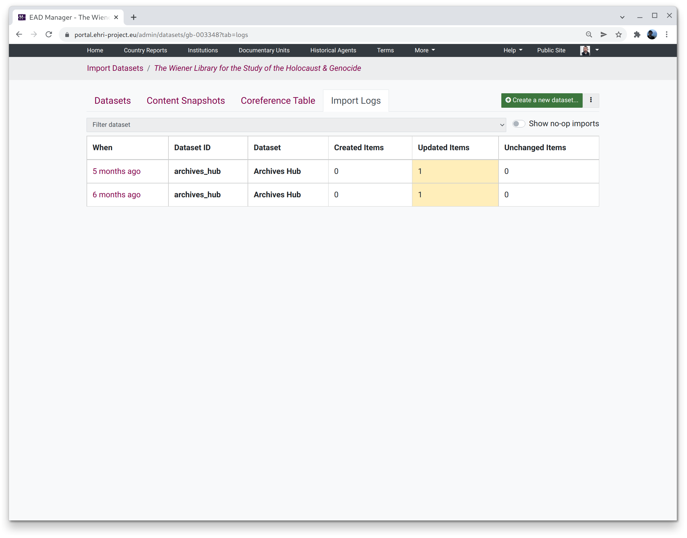

***********
Import Logs
***********

Import logs are what they sound like: records of when data was imported and what changed. By default no-op imports,
which did not result in any new or updated items, are not shown.

