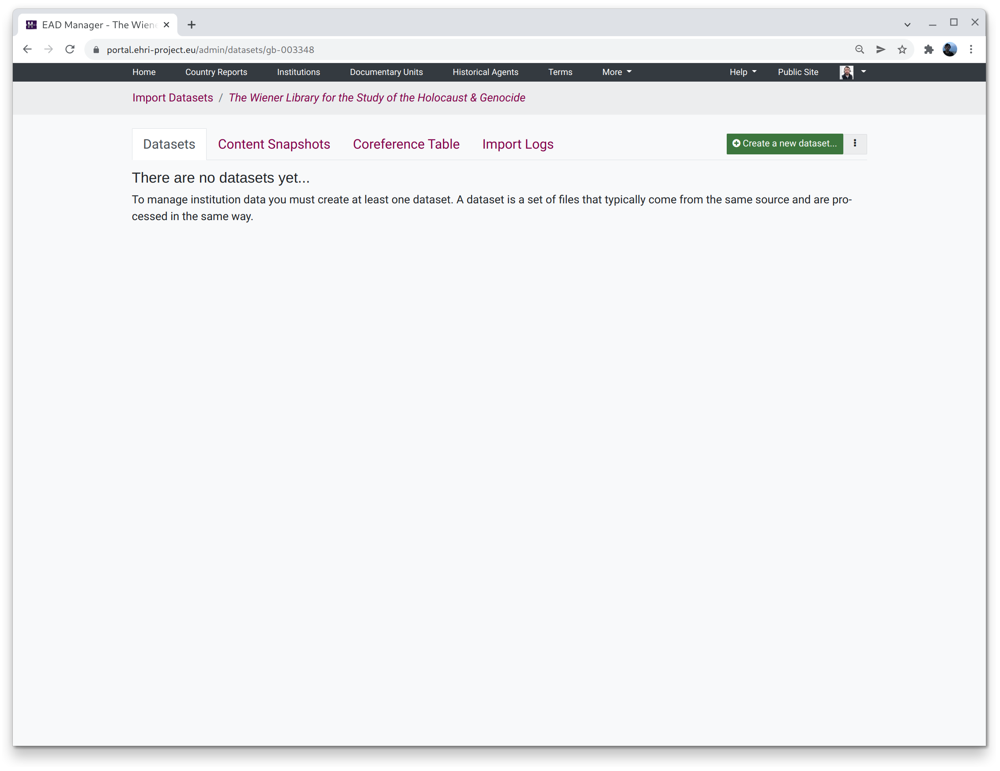

Managing Datasets for Ingest
================================

.. toctree::
   :hidden:
   :maxdepth: 1

   datasets/index
   datasets/csv-import
   datasets/xquery-mappings
   content-snapshots
   coreference-table
   import-logs

This documentation describes EHRI's tools for managing, transforming and ingesting *structured data* collection descriptions. In a
nutshell, it allows administrators to:

* manually upload or harvest data in XML or `CSV format <datasets/csv-import.html>`_
* validate XML against EHRI's EAD schema
* transform arbitrary XML to EAD using either XSLT or tabular XQuery mappings
* ingest the resulting EAD XML (or CSV) into the EHRI portal
* perform cleanup actions to keep the EHRI portal in sync with third-party datasets

Accessing the Import Manager
----------------------------

The Import Manager can be accessed via the "Ingest" section on the institutions admin page.

Overview of the Import Manager
------------------------------

The Import Manager home page has four tabs:

* :doc:`Datasets <datasets/index>`
* :doc:`Content Snapshots <content-snapshots>`
* :doc:`Coreference Table <coreference-table>`
* :doc:`Import Logs <import-logs>`

For common cases you'll only have to use the `Datasets <datasets.html>`_ tab. See `here <datasets.html#transformation>`_ for info about
transformation datasets via `XSLT <datasets.html#xslt>`_ or `XQuery <xquery-mappings.html>`_.

