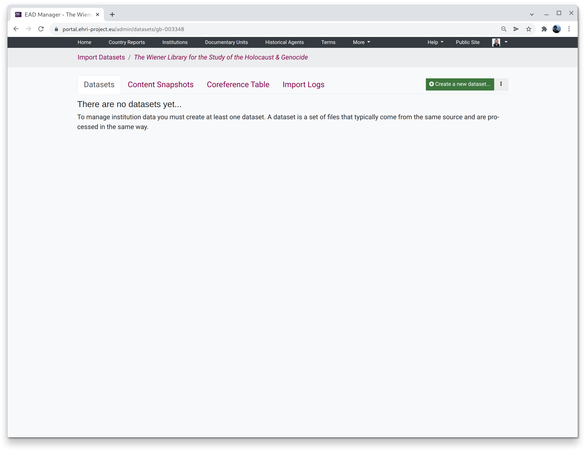

Managing XML Datasets for Ingest
================================

This documentation describes EHRI's tools for managing, transforming and ingesting XML collection descriptions. In a
nutshell, it allows administrators to:

* manually upload or harvest XML files
* validate XML against EHRI's EAD schema
* transform arbitrary XML to EAD using either XSLT or tabular XQuery mappings
* ingest the resulting EAD into the EHRI portal
* perform cleanup actions to keep the EHRI portal in sync with third-party datasets

Accessing the EAD Manager
=========================

The EAD Manager can be accessed via the "Ingest" section on the institutions admin page.

Overview of the EAD Manager
===========================

The EAD Manager home page has four tabs:

.. toctree::
   :maxdepth: 1

   datasets
   xquery-mappings
   content-snapshots
   coreference-table
   import-logs

For common cases you'll only have to use the `Datasets <datasets.html>`_ tab. See `here <datasets.html#transformation>`_ for info about
transformation datasets via `XSLT <datasets.html#xslt>`_ or `XQuery <xquery-mappings.html>`_.

