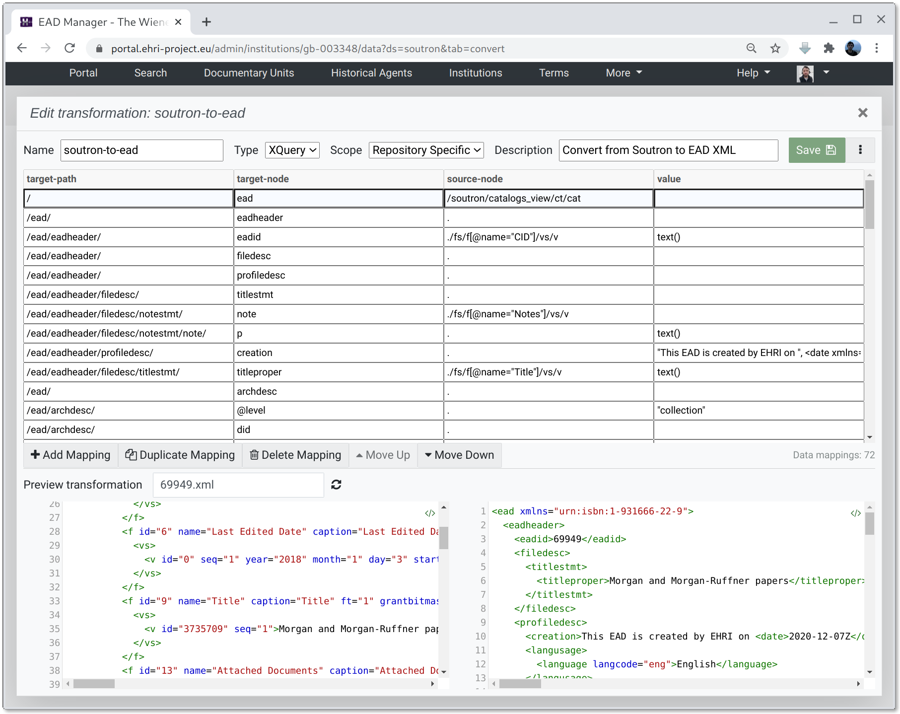

*****************************************
Tabular EAD generation and transformation
*****************************************

In the `EHRI EAD dataset management interface <institution-data.html>`__ XML can be transformed using two types of transformation: XSLT documents
and tabular XQuery mappings. XSLT is more suitable for making small changes to documents, whereas XQuery transformations
can use the more expressive programmatic syntax to perform more complex tasks in a slightly easier way (your mileage
may vary though.) This documentation describes how tabular XQuery transformations are specified.

Each mapping consists of four fields:

target-path
  an XPath specifying where to create a node in the output document. This value must end with a ``/`` character.

target-node
  the local name or, when prefixed by the ``@`` symbol, attribute name to create within the target-path.

source-node
  an XPath expression pointing to a node within the source document, or ``.`` if the output node does 
  contain a value referencing the source.

value
  an XPath expression giving the value of the target node, given the source node as context. For example,
  the expression ``text()`` would return the text value of the source node, whereas a quoted string such
  as ``"Some text"`` would give a literal value. 

Documents should be built by adding mappings in hierarchical order, i.e. the ``/ead`` node should go before the
``/eadheader`` node.        

The follow provides an example that creates a minimal EAD document with fixed dummy values, and doesn't reference any
source document (you won't actually want to do this, but go with me here):

.. csv-table:: XQuery example 1
   :file: xquery-example-1.csv
   :header-rows: 1
   :class: longtable
   :widths: 1 1 1 1

That should generate output that looks like the following:

.. code-block:: xml

    <ead xmlns="urn:isbn:1-931666-22-9">
      <eadheader>
        <eadid countrycode="GB">example-1</eadid>
        <filedesc>
          <titlestmt>
            <titleproper>Example EAD</titleproper>
          </titlestmt>
        </filedesc>
      </eadheader>
      <archdesc level="fonds">
        <did>
          <unitid>example-1</unitid>
          <unitdate>2021-06-01</unitdate>
          <unittitle>Example EAD</unittitle>
          <physdesc label="Extent">
            <extent>1 scrap of paper</extent>
          </physdesc>
        </did>
        <scopecontent>
          
Merely an example

        </scopecontent>
        <accessrestrict>
          
None

        </accessrestrict>
      </archdesc>
    </ead>

With the basic structure in place we can start adding references to the source document, which, for the sake of
simplicity, will be some Dublin Core:

.. csv-table:: XQuery example 2
   :file: xquery-example-2.csv
   :header-rows: 1
   :class: longtable
   :widths: 1 1 1 1

Now, put actual values in the third ``source-node`` column to reference the source, and an expression in the forth
column (in this case just ``text()``) to say what we want to do with the node.

Although this example is simple, these columns accept any XQuery expressions so can be as complicated as you need.

XQuery transformation parameters
================================

Unlike XSLT transformations, the JSON-format parameter map can be given for specific dataset transformations doesn't
provide values that are readable by XQuery expressions. It _can_ however be used to provide additional namespace
prefixes that can be referenced in the ``source-node`` expressions. For example, the given JSON parameter map:

.. code-block:: json

    {
        "xlink": "http://www.w3.org/1999/xlink"
    }

would enable yuo to use expressions like ``//xlink:href`` in the ``source-node`` field.

Tips and tricks
===============

Split a string containing multiple values into a set of separate nodes:
~~~~~~~~~~~~~~~~~~~~~~~~~~~~~~~~~~~~~~~~~~~~~~~~~~~~~~~~~~~~~~~~~~~~~~~

In this case we have a node containing several values separated by a semi-colon:

.. code-block:: xml

    <indexentry>
        <geogname>Deutschland; Großbritannien; Kanada; Frankfurt am Main; Mannheim</geogname>
    </indexentry>

We want to break this into several individual nodes:

.. code-block:: xml

    <controlaccess>
        <geogname>Deutschland</geogname>
        <geogname>Großbritannien</geogname>
        <geogname>Kanada</geogname>
        <geogname>Frankfurt am Main</geogname>
        <geogname>Mannheim</geogname>
    </controlaccess>

For these two nodes we could use the following mappings:

.. csv-table:: XQuery tokenization example
   :file: xquery-tokenize-example.csv
   :header-rows: 1
   :class: longtable
   :widths: 1 1 1 1

That is:

 - create a node for the `controlaccess` (no value is needed here since it's a parent node)
 - create a node for the `geogname` values
 - for the geogname path, split the text value using `fn:tokenize(/path/to/node, delimiter)`, where the path points to the source path
   and the delimiter is a ";"
 - use "." for the value since we're already dealing with strings and not nodes

Gotchas
=======

Unfortunately there are quite a lot of ways to get difficult-to-understand errors from the mapping process due to the
way the table is evaluated against the source document. Some example and possible fixes follow:

Error: mapping-error at /ead: mapping-error at /ead/eadheader: err:XPST0003 at /ead/eadheader/eadid: Unknown function or expression.
  this error resulting from the use of unicode quotes, specifically the unicode “right double quotation mark“ symbol
  instead of "normal ascii double quotes", that in turn resulted from copying and pasting to and from a text editor
  that sneakily replaced them. This was hard to spot. More generally, and XPST0003 error is likely to be the result
  of the fourth column - the output value - being a malformed XQuery expression or mistyped function.

  **FIX**: be careful that quotes are ascii quotes and no other typos exist in the 4th column

Cannot get the value of an attribute with a path like `/oai/description/@type`.
  Use a "`.`" instead of "`text()`" as the value expression since we want the verbatim value, which is already
  a string and not a node.

Target paths are missing from output.
  Make sure that the target path (first column) value ends with a forward-slash: "/".