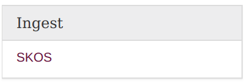
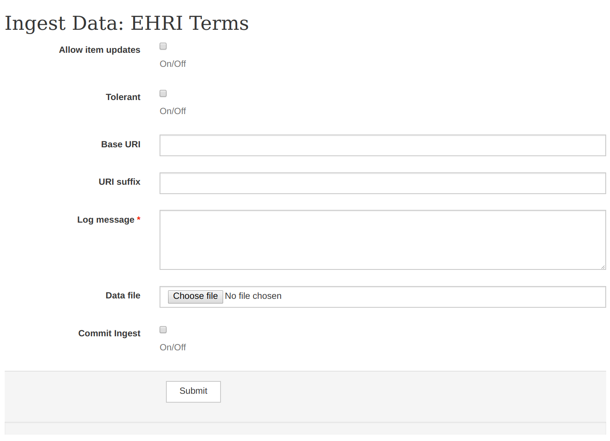

SKOS Ingest
==========

Users with the appropriate permissions can update a vocabulary by importing a RDF-XML SKOS file. On the right
hand side of the vocabulary page you'll see this section of the sidebar:

That will lead to the following form:

The options on this form are as follows:

Allow Item Updates
  Checking this box shows intent that the data to be ingested could update items already in the database.

Tolerant
  This will prevent the ingest task aborting if there are individial validation errors during the process. Leave this
  unchecked unless you really know what the validation errors are and that they can be safely ignored.

BASE URI
  The common prefix of the URI shared by items in this vocabulary. For example, if an item URI was 
  ``http://test.example.com/123/`` with the item-unique part being ``123``, the base URI would be 
  ``http://test/example.com/``.

URI Suffix
  The common URI suffix shared by items in this vocabulary.  For example, if an item URI was 
  ``http://test.example.com/123/`` with the item-unique part being ``123``, the suffix would be ``/``.
  Leave this empty if there is no suffix.

Log Message
  A mandatory message providing the context of this data import (where the data came from, etc.)

Data File
  The actual SKOS payload, as RDF-XML.

Commit Ingest
  Without this box checked the importer will work in dry-run mode, and not actually commit any changes to the database.
  This is very useful if you want to validate its behaviour, and at least one dry-run should be made.

On clicking submit the payload file will upload and in due course you should start to see some progress messages appear,
like the following:

::

  Finished uploading data...
  Initialising ingest for job: 5124c9ae-4f2a-4db3-bf3c-2cdffcdc8fc0...
  Ingesting... |
  Ingesting... /
  Ingesting... -
  Ingesting... \
  Ingesting... |
  Data: created: 0, updated: 913, unchanged: 0, errors: 0
  Task was a dry run so not proceeding to reindex
  Uploading log...
  Log stored at https://s3-eu-west-1.amazonaws.com/ehri-data/ingest-logs%2Fingest-20180731102737-3f2acd2b-abc4-4411-8d07-12345678.json
  Done

