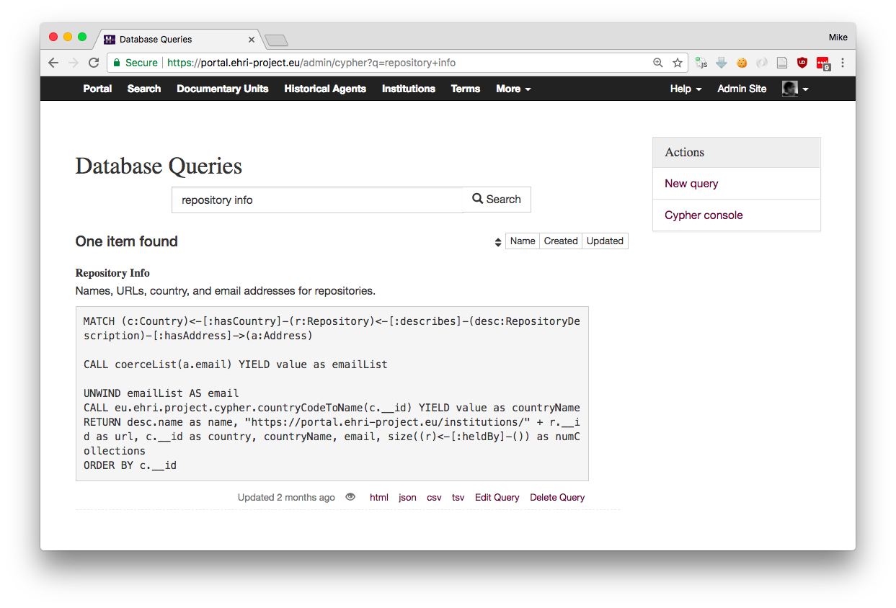
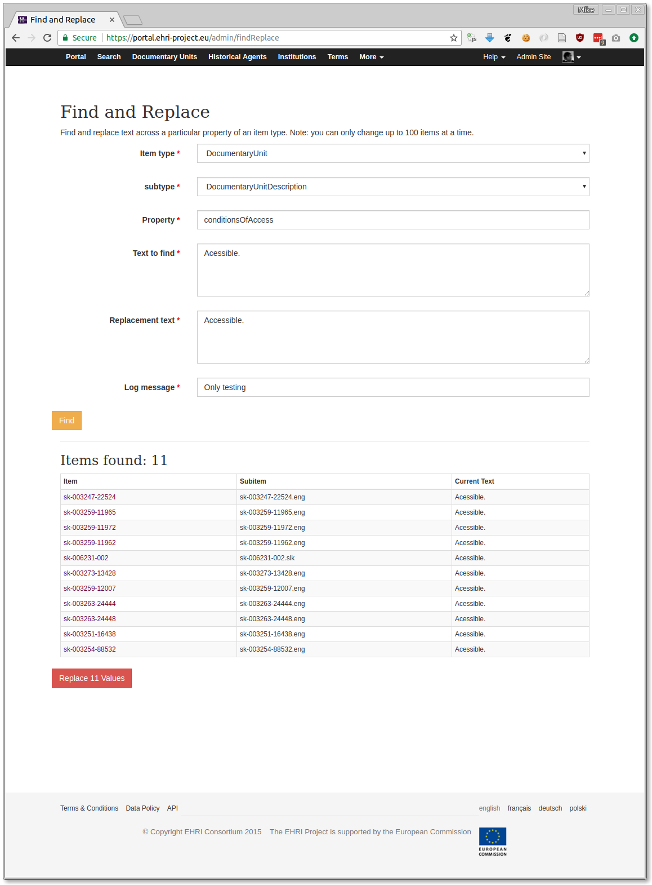

.. _super:

Superuser Administration Tools
==============================

Superusers will have a number of extra database administration tools available to them in the 'More...' section of the
EHRI admin menu. **BEWARE**: these are often dangerous if not used with due consideration!

Database Queries
----------------

Database queries are `Cypher queries <../technical/frontend/cypher.html>`_ that can be saved in order to produce a
particular type of tabular data on demand, with the results available as JSON, TSV, or CSV.

Viewing the query as HTML will show you the results and allow you to download them in other formats.

Refresh Search Index
--------------------

While most of the time the frontend app keeps the search index in sync with the database, it's sometimes necessary to do
this manually. Especially when, for example, you tinker with the database outside of the app, which does happen from
time to time. At the time of writing, rebuilding the search index from a clean slate takes about 10-15 minutes, but
refreshing individual data types (e.g. repositories or links) is much quicker. The "Refresh Search Index" page provides
an interface that allows you to rebuild specific data types, or the whole index if necessary.

There are a few options on this page:

Clear Entire Index First
  This will delete everything from the search index. Don't check this unless you really was to rebuild from scratch

Clear Each Type First
  This will delete all items of corresponding data types from the index. This is useful if you think there is leftover
  data or orphaned items and can often be good practice to keep things clean. Beware though, if you check this people
  will not be able to search for items of that type while they are reindexing (i.e. the delete and reindex operations
  are not transactional.)

Types to Update
  A list of data types to reindex, check those that apply.

Find and Replace
----------------

Find and Replace allows you to replace known property values for a specific item type with some other value. **This is a
potentially dangerous tool and should be used with care.** You also need to know something about the database schema to
use it effectively, but it is useful doing behind-the-scenes corrections on a lot of items, for example, fixing broken
URL references. 

The form has a number of options:

Item type
  Select the database name of the *content type* you want to alter

Sub-type
  Select the component (or subordinate) type of the database node to operate on, or the content type if they are the
  same

Property
  Type the name of the subtype's property to search

Text to find
  The text to match

Replacement text
  The replacement text

Log message
  Explain (for the audit log) why this change took place

Once you click the "Find" button the database will be searched for matching candidates. This may take some time if
you're searching a populous item type (reason: it does a full iteration rather than an index lookup.) Items matching the
text to find will be listed below. Check this looks how you'd expect. Then click the "Replace [num-found] values" button
to commit the change.

Note: you can only change up to 100 values at a time.

Regenerate Item IDs
-------------------

The database-wide ID of EHRI items is, for hierarchical items like documentary units, based on its *local* identifier
property, combined with the local identifiers of it parent items. Sometimes, however, people change the local
identifiers, which makes the database wide ID and local identifier go out of sync. The main harmful consequence of this
is that people could create items with duplicate local identifiers within the same scope, but this actually isn't very
likely so we don't currently do anything to prevent it.

Regenerating IDs recalculates what the item's ID *should* be based on its hierarchy. You can choose to do this for a
type of item *or* items within a particular scope.

There is also an **Ignore Collisions** option, which requires some explanation...

It is possible for regenerated IDs, which should be unique, to collide with existing items depending on the order that
they are calculated.

For example, if item ``a1`` has been renamed to ``a2`` and item ``a2`` renamed to ``a3``, ``a2`` must be renamed first
or the new ID for ``a1`` will collide with it. The ID regenerator is not smart enough to figure this out so it will
simply complain about the collision.

If, however, we ignore any items that would result in collisions if renamed, in this example ``a1``, then item ``a2``
will be renamed to ``a3`` and the second time we run ID regeneration the collision problem will go away because the old
``a2`` item will have previously been renamed. ``a1`` can then be renamed to ``a2`` without causing a collision.

This scenario is surprisingly common if archivists mistakenly give items the wrong local identifiers and then change
them later.

Clicking **Scan Items** will detect items that require ID regeneration. When it finishes (and scanning a large number of
items can take some time) you will be presented with a screen that allows you to select or deselect any items to rename.

Path Prefix
~~~~~~~~~~~

There is an additional option called the **path prefix** which is required. This is consists of the part of the item's
URL *path* before its identifier. For example, the URL path of a public documentary unit item is ``/units/{ID}`` and its
admin page ``/admin/units/{ID}``. The path prefixes are therefore ``/units/`` and ``/admin/units/``. So the value that
needs to go in the path prefix box is ``/units/,/admin/units/``.

**Sorry this is all so complicated.**

You can them commit the changes to the database and 301 moved-permanently redirects will be generated for the old item
URLs based on the given path prefix.

Rename Local Identifiers
------------------------

This allows for a bulk renaming of item local identifiers, regeneration of the global IDs, and generation of 301
redirects. The form requires a CSV file with no headers and two columns consisting of:

1. the item's current global ID
2. the item's new local identifier

The `path prefix <#path-prefix>`_ option is the same as described above.

Reparent Items
--------------

This allows for bulk moving of items from one scope (parent) to another. The form requires a CSV file with no headers and two columns consisting of:

1. the item's current global ID
2. the global ID of the item's new scope

The `path prefix <#path-prefix>`_ option is the same as described above.

Batch Delete Items
------------------

This form allows bulk deleting items. Obviously it should be used with great care and in rare circumstances!

Options:

**Item scope**
  If the items share a scope, provide its global ID here

**Create pre-delete version**
  In some cases you'll want to create a version of the item recording it's pre-delete state. In other cases, e.g.
  correcting items that should never have existed in the first, you won't.

**Log message**
  An explanation for why you're deleting these items.

**IDs**
  Paste the IDs of the items to be deleted here, one per line. If you put too many IDs here it will complain about the
  form entity size, so there's a limit to how many can be deleted at once.

**Commit changes**
  This confirms you actually want to go ahead with the delete operation.
