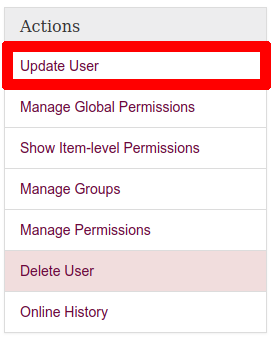
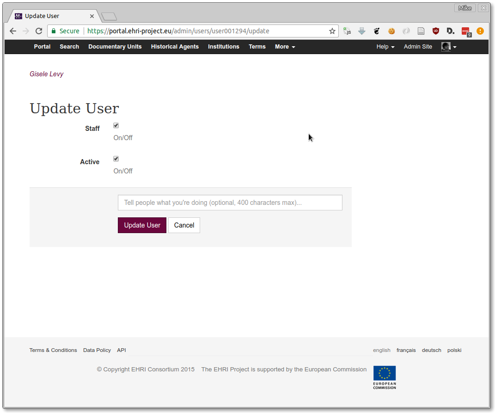

**************
Managing Users
**************

Users are managed by from `users page <https://portal.ehri-project.eu/admin/users>`_ on the admin
site.

Enabling Staff access
=====================

For someone to access the portal data management pages they must have an active staff account. To grant
someone access, you must first be a "super user" (if not, speak to someone who is.) Then, make sure the
user to whom you want to grant access has signed up to the portal in the normal way via the `registration page
<https://portal.ehri-project.eu/login#register>`_.

Next, find their account and choose "Update User" from the sidebar actions:

Finally, in the following screen, check the "staff" box (making sure that the "active" box is also checked.)

**Note**: if the user has not yet verified their email address but you know it's valid, there's an additional
option to verify them manually.

