**************************************
EHRI Omeka (Classic) plugins and theme
**************************************

TEI editions plugin
===================

The EHRI team chose to use the Omeka web publishing platform for the
documentary editions due to its compliance with standards (Dublin Core)
and extensibility, as well as for the functionality of the Neatline
mapping plugin. By default, however, Omeka was not capable of displaying
TEI, nor of extracting structured information from XML sources. For this
reason the EHRI team originally developed the Omeka Classic plugin for
the digital editions.

The TEI Editions plugin developed by EHRI takes care of the editions
workflow within Omeka by handling TEI document ingest, update, and
association of tertiary material such as images. It also provides
various display functionalities used by the Omeka frontend (theme).

The plugin supports the editorial workflow which links document
annotations to controlled vocabularies (EHRI, Geonames), EHRI archival
descriptions and other resources. The plugin makes it possible to use
documents encoded in the TEI P5 XML format to build a rich Omeka
presentation.

The plugin allows you to:

-  Enhance headers of TEI documents with metadata from the EHRI Portal
   and Geonames
-  Create Omeka items from uploaded TEI files, with Omeka metadata
   elements populated via customisable XPath mappings
-  Associate images and other tertiary files
-  Create Neatline exhibits from location data and other metadata in the
   TEI headers

Edition workflow in Omeka
~~~~~~~~~~~~~~~~~~~~~~~~~

The plugin has three main areas of functionality:

-  Ingesting, updating, and associating tertiary files with TEI-based
   Omeka items
-  Exporting TEI data and associated files
-  Configuring XPath-to-Omeka field mappings

Considering the TEI-encoded representations of the original documents as
the primary data source, the EHRI editions workflow is based on the
possibility of repeatable ingest of TEI XML files into Omeka. The plugin
counts on any changes to documents being made in the TEI files rather
than directly in Omeka. Metadata in Omeka fields will be updated
accordingly.

Users can use the edition's administrative interface to upload one or
multiple TEI files.

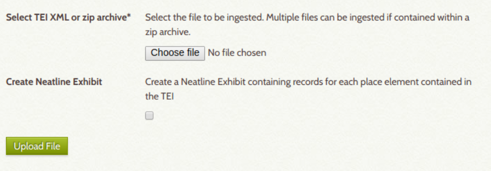

Documents can either be ingested one-by-one or as a zip file containing
multiple files.

Neatline presentations are also automatically created during the ingest,
provided geographic data is available. The plugin uses normalised
entities from the TEI header to create records within Neatline
presentations. It also enriches the document text with Neatline specific
codes and saves it in the presentation metadata which makes it possible
to link text to the interactive map. A template presentation selected in
settings is used to include data common to all Neatline presentations,
typically including historical borders.

Users can upload associated files which are automatically added to the
relevant Omeka records based on matching of file names with identifiers,
for example

Editions shortcodes
~~~~~~~~~~~~~~~~~~~

The integration of the documents into the narrative content of the
edition (such as introductions and historical overviews) and to create
index pages according to the needs of individual editions, the plugin
relies on an extension of the functionality of Omeka shortcodes. The
following shortcodes were added:

.. code-block::

    [editions_item identifier=[Identifier]]

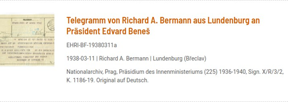

    Fig. 1 Individual item summary as displayed in the online edition

To display recent items formatted according to the editions layout:

    [editions_recent_items num=[num]]

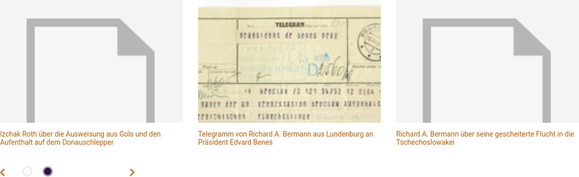

    Fig. 2 Display of recently added items

To include an index based on the metadata ingested from the TEI
documents and used for faceted browse::

    [editions_index element=[Metadata element]]

For instance::

    [editions_index element=Subject]

    [editions_index element=Place]

    [editions_index element=Person]

    [editions_index element=Organisation]

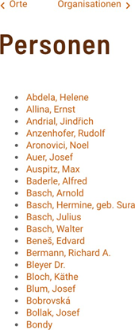

    Fig. 3 Index: List of people linked to in the edition

The separate `EHRI Omeka plugin <https://github.com/EHRI/ehri-omeka-plugin>`_
integrates EHRI data into Omeka by adding
a shortcode to display short information about EHRI items such as
collection holding institutions or collection descriptions. For
instance::

    [ehri_item_data id="us-005578"]

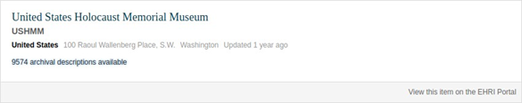

    Fig. 4 Short information about collection holding institutions via the
    EHRI Omeka plugin, as displayed in the online edition

This plugin is also used to display EHRI references on document pages
based on the linked data encoded in TEI files.

EHRI Editions Omeka theme
=========================

The frontend for the publication of documents and contextual information
was developed as a theme for the Omeka 2.\* (Classic) web publishing
platform. The theme, implemented in PHP/CSS/JS, was carefully prepared
by EHRI team with a particular view to:

-  Create a clean user interface rendering documents encoded in TEI with
   focus on reading experience.
-  Enable faceted browse based on entities tagged in document texts.
-  Enable display of document data using automatically generated
   interactive maps.
-  Make it possible to deploy the theme for multiple editions, while
   also allowing them to be differentiated based on layout.

The editions’ user interface was designed to allow for easy and focused
reading of document transcripts, without overburdening researchers with
contextual information or navigation. The faceted browse and the
navigation (menu) were integrated into a pane on a left-hand side which
is hidden by default on document pages and can be expanded on demand.

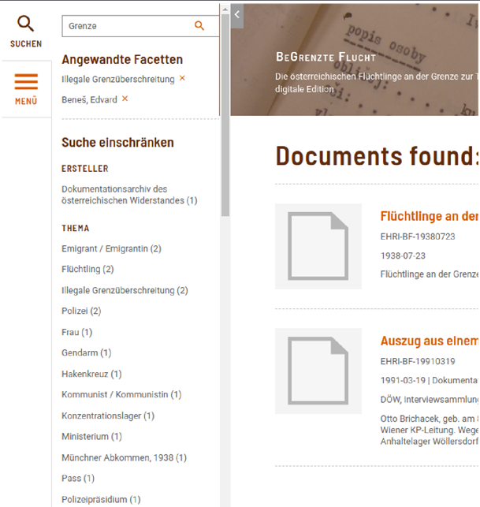

    Fig. 5 The faceted browse and the navigation menu

The user interface was built primarily for scientific usage. In addition
to full-text search, the edition platform focused on providing faceted
browse based on the linked data encoded in the TEI documents. The
listing of documents on the result set also provides rich detail
including creation information, archival citation and, where necessary
and available, a short annotation. Visual representations (scans) of the
documents are shown but aren’t required, nor are they central for the
presentation.

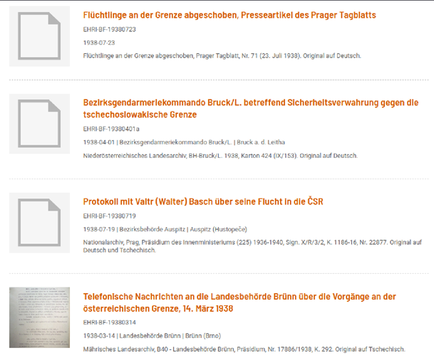

    Fig. 6 Results of a search in the EHRI edition, listing document
    summaries

As a text-centric platform, particular attention was devoted to the
display of the document which consists of several sections. The first
section lists document metadata which include creation information (date
and place of creation, creators) and archival or bibliographic citation
as well as information about original language.

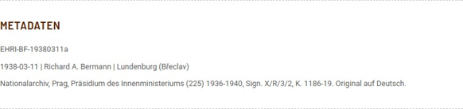

    Fig. 7 Document metadata including creation information, archival or
    bibliographic citation and information about the original, as shown in
    the EHRI edition

Document text (transcript) can be made available in several languages
whereas it is always first displayed in the main language of the
edition. The default design reproduces text in a font imitating a typing
machine, typical for the period of the 20th century. Annotated terms
(where linked data is available) are highlighted in a way which doesn’t
distract from reading.

On mouse over, a contextual box in the right-hand column with further
information and links to authoritative vocabularies and resources (based
on normalised records in TEI header) is displayed.

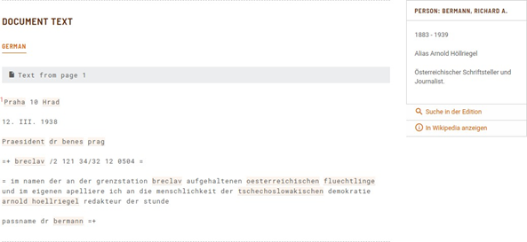

    Fig. 8 The contextual box (right-hand column) with further information
    and links to authoritative vocabularies and resources

Where location information is available with geographic coordinates, an
automatically generated interactive map is displayed, created through
the Omeka Neatline plugin. Its fullscreen version, which users can
access through a link, provides document text alongside the map,
allowing to follow the narrative of the document in space.

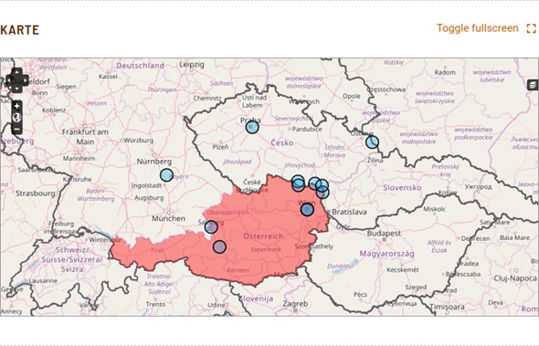

    Fig. 9 The automatically generated interactive map

If the underlying TEI document contains in the <**msDesc**> element
references to EHRI archival information, a section with references is
included containing abbreviated information about EHRI country reports,
archives and collections fetched through the EHRI API.

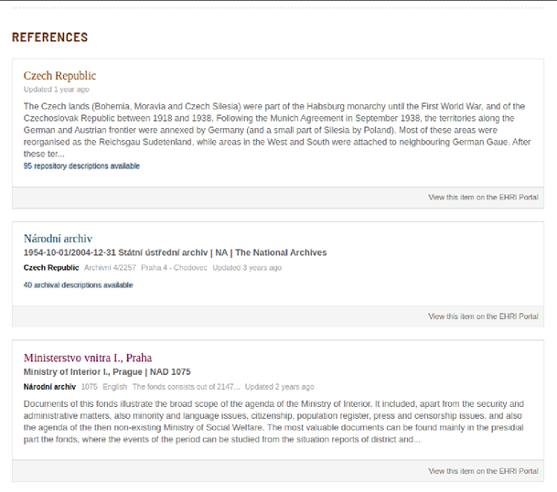

    Fig. 10 Display of references to EHRI archival information

The document page also includes the possibility to download the TEI
sources file as well as the document in PDF and ePub format. A simple
plugin allows users to provide non-public feedback to the editors.
Optionally, the Omeka Commenting plugin can be enabled to allow publicly
visible commenting (typically with moderation).

The latest version can be downloaded from `Github <https://github.com/EHRI/ehri-editions-theme/releases>`_.

