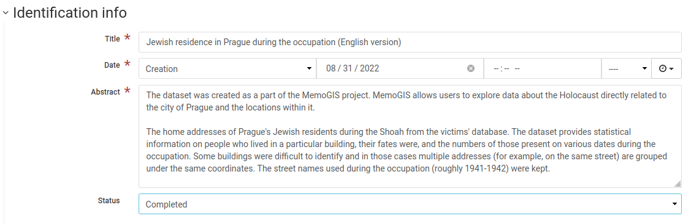
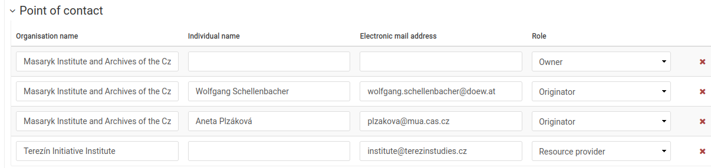
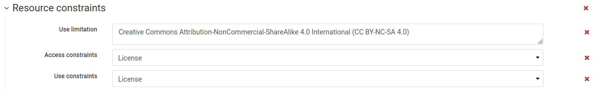
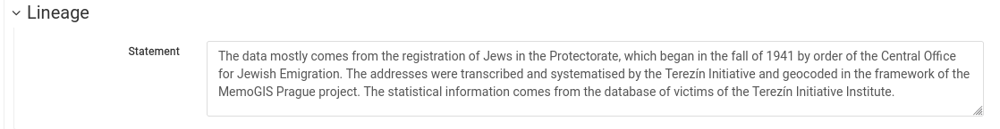
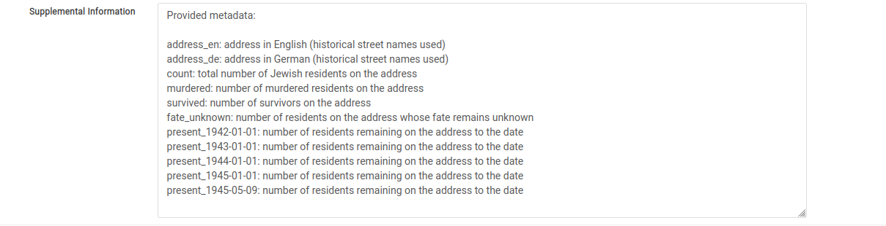

How to contribute
=======================

The EHRI Geospatial Repository is a service to the research community for sharing and reusing Holocaust-related geodata such as historical borders, locations of ghettos and camps, historical maps and more. We welcome your contributions, be it project results, archival sources or research data and will be happy to assist you in the process.This document provides a detailed guide on how to contribute geodata to the Geospatial Repository, with a particular emphasis on preparing the metadata describing your dataset in a step-by-step manner. 

Prepare metadata
----------------
EHRI stores the metadata describing your dataset in the open source metadata catalog `GeoNeonetwork <https://geonetwork-opensource.org/>`_ in a standardised way. Primarily, we prefer the usage of the ISO 19115/19139 standards which provide guidance for the description of geospatial data.

Users who wish to contribute, need to provide relevant metadata which can be provided to EHRI through a `separate form <https://forms.office.com/e/gQwcmbswVe>`_. The EHRI staff will check the information and will be in touch with you regarding next steps. We will do our best to help you to create standardised metadata and data. 

We prefer metadata in English. Nevertheless, GeoNetwork partially supports multilingual descriptions.

The following description uses the GeoNetwork entry form using the 19115 standard template to explain the structure. It is a minimal description documenting the most important metadata only. For details, please refer to the `GeoNetwork documentation <https://geonetwork-opensource.org/manuals/4.0.x/en/user-guide/describing-information/index.html>`_. (The screenshots below are taken from this `sample record <https://geodata.ehri-project-test.eu/geonetwork/srv/eng/catalog.search#/metadata/62c0ed01-9c16-4ad9-964c-860388767c09>`_.)

Title
_____
Create a short descriptive title of the record which indicates the type of data (borders, camps, historical map…), the geographic area and - if relevant - the temporal extent.

Abstract
________
Provide a longer description of the record explaining the content, the temporal and spatial coverage and, if appropriate, the context of its creation.

    
    
Authorship and ownership
___________________________
State the responsibility for the creation and maintenance of the data and provide contact(s).

    
License
____________
State the license which governs the usage of the provided data. We encourage the choice of the Creative Commons licenses.

    
Lineage
_________
Explain the provenance of the data and the steps taken to prepare it. Please be as detailed as possible in order that users can understand the strength and possible gaps or unknowns.

    
Supplemental information
___________________________
Use the field to describe the structure of your data and list the individual fields with an explanation (if needed).

    
The above is the minimal description of a dataset; EHRI staff can help you fill in further fields.

Prepare the dataset
--------------------
EHRI internally stores the datasets in its Geoserver which exposes the data via different services such as Web Map Service (WMS) (in nutshell: returns map layers as images) or Web Feature Service (WFS) (returns structured geospatial data). For matters of coherence and performance, we store all data in the GeoPackage format.

We can upload your original dataset to the GeoNetwork repository and attach it to the metadata in different formats (such as a shapefile, geojson, CSV, or even MS Excel).

EHRI does not prescribe the field names in the datasets, but we recommend to use human readable naming, for instance “name” for place names.

Once the dataset is available, the EHRI staff will check the data, convert it as needed and store it in the Geoserver. Once available, we will link the GeoNetwork metadata record to the WMS and WFS services.

We strongly prefer all text data to be encoded in UTF-8.

There are different options to convert data to GeoPackage, such as:
EHRI conversion tool from CSV to GeoPackage: the tool allows to select the longitude and latitude fields, and other data types
qgis: Open source GIS desktop editor: Save layer as GeoPackage
ogr2ogr commandline tool which can convert between different types of geographic data

GeoPackage and layer naming convention:

[project]-[description]-[lng]-[version/date]

Examples:
MGS-prague_residences-v1-cze.gpkg or MGS-prague_residences-20220808-cze.gpkg
MGS_prague-residences_v1.0001.tif
MGS_prague-residences_v1.0002.tif

