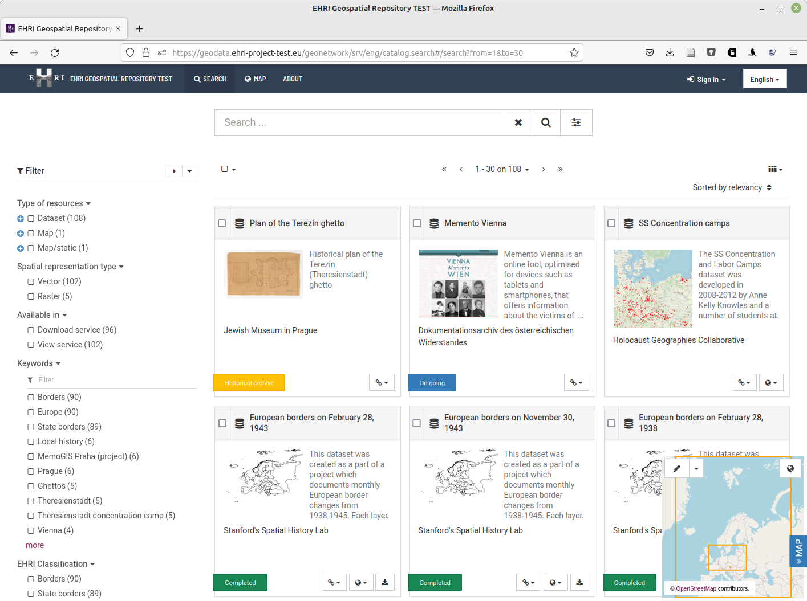

EHRI Geospatial Repository - Documentation
==========================================

By providing access to data about Holocaust-related places and spaces, the `EHRI Geospatial Repository <https://geodata.ehri-project.eu>`_ facilitates research driven by spatial and geographic approaches. It builds on the spatial turn in the field of Holocaust Studies: over the past years, the research in Holocaust geographies, as conducted by the `Holocaust Geographies Collaborative
<https://holocaustgeographies.org/>`_  and others, advanced new perspectives and methods. Thinking through place and space helps to formulate new questions and research projects.
    

Contents:

.. toctree::
   :maxdepth: 1
   :glob:

   introduction
   data
   adding-datasets
   document_blog_contribution

   *

