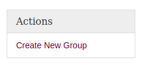
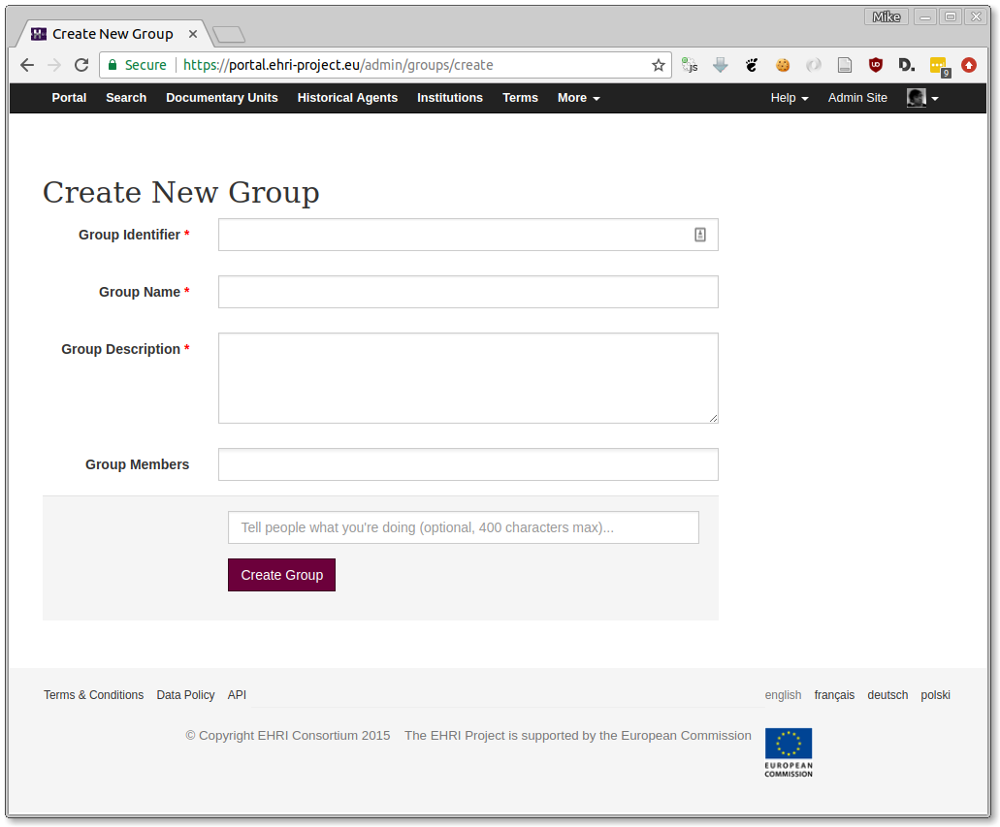

======
Groups
======

Groups in the EHRI portal admin provide a way to give users *role-based* permissions. Permissions granted to a group
will be inherited by all users who belong to it. Groups can also belong to other groups, so access to certain
functionality can be tiered.

Creating Groups
===============

Groups can only be created by EHRI super-users (those belonging to the **admin** group.) Super-users will have the
option to create new groups on the right-hand-size of the groups page:

The form to create a new group contains the following options:

Identifier
  A short lowercase one-word identifier to distinguish the
  group, for example: "wp9". This must be unique within the system.

Name
  The name of the group.

Description
  A textual description of the purpose of the group.

Group Members
  If you know the users who should belong to this group
  in advance you can select them here.

Additionally, you can choose to add a message to the audit log so people know why you created this group. If you don't
have anything to add, just leave it blank.

Managing Group Permissions
==========================

TODO

Adding Users to Groups
======================

TODO

