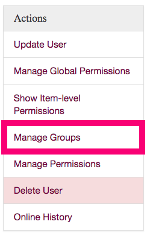

.. _groups:

======
Groups
======

Groups in the EHRI portal admin provide a way to give users *role-based* permissions. Permissions granted to a group
will be inherited by all users who belong to it. Groups can also belong to other groups, so access to certain
functionality can be tiered.

Creating Groups
===============

Groups can only be created by EHRI super-users (those belonging to the **admin** group.) Super-users will have the
option to create new groups on the right-hand-size of the groups page:

The form to create a new group contains the following options:

Identifier
  A short lowercase one-word identifier to distinguish the
  group, for example: "wp9". This must be unique within the system.

Name
  The name of the group.

Description
  A textual description of the purpose of the group.

Group Members
  If you know the users who should belong to this group
  in advance you can select them here.

Additionally, you can choose to add a message to the audit log so people know why you created this group. If you don't
have anything to add, just leave it blank.

Adding Users to Groups
======================

To add a user to a group find their account on the Users page. Then visit "Manage Groups" item from the actions menu:

Then, select the group to which you want to add them from the list.

Managing Group Permissions
==========================

**NB**: For background on the EHRI admin permission system, see the :doc:`permissions` page.

There are several classes of permission in the EHRI portal's administration system:

Global
  Allows groups (or individual users) to manage entire classes of item, e.g. archival units or repositories.

Item Level
  Allows groups (or users) to manage individual items, e.g. a single repository.

Scoped
  Allows groups to manage a class of items within a particular scope, e.g. archival units within a specific repository.

In practice these different types of permissions are often combined. A common case is a group that represents users who
are associated with a particular repository/institution. In this case the group might typically be given *item level*
permission to update the repository's description, and *scoped* permissions to create, update, or delete archival
descriptions owned by that repository.

