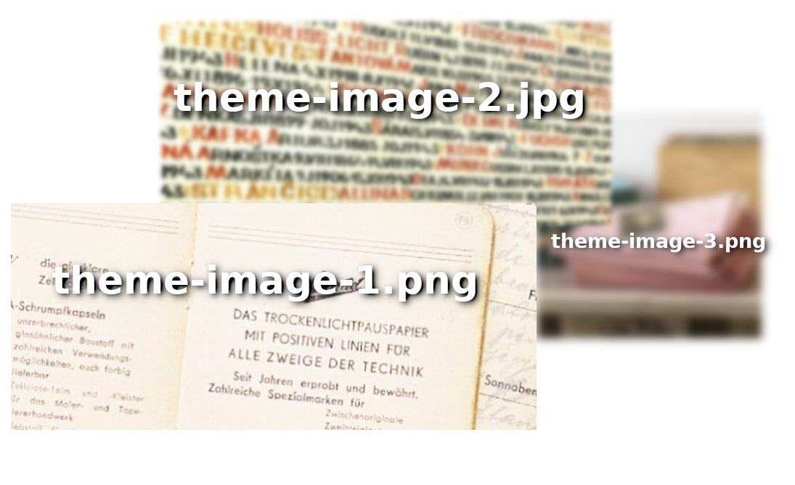

Adapting the National Node template site
========================================

Developing web sites, especially multi-lingual ones, can be a complicated business and there are many ways to go about it.
For example, you could use a WYSIWYG site builder like Squarespace or Wix, a CMS like Wordpress or Drupal, or even write
a site by hand using HTML and CSS. In order to make it easier to get started, we have created a template site that can
be used as a placeholder until a permanent solution is found, or adapted to the specific needs of different EHRI National Nodes. This
template makes use of a static site generator called `Hugo <https://gohugo.io>`_ which is highly customisable, supports multiple languages, and
is fast and straightforward to deploy.

Introduction
------------

Static site generators are a type of software that takes a set of files and converts them into a website. The files are
written in a markup language such as Markdown or HTML, and the generator converts them into HTML, CSS and JavaScript.
This means that the site can be hosted on any web server, and does not require any special software to be installed on
the server. The site can be edited using any text editor, and the changes can be previewed locally before being deployed
to the server. Hugo sites make use of "themes" which are collections of files that define the look and feel of the site.
EHRI has developed a theme for National Node sites, which can be found separately at https://github.com/EHRI/ehri-nn-hugo-theme.


    An example of a National Node site using the template

In this documentation we will assume that the NN site will be deployed on Github Pages, which is a convenient way to host
static content for free. However, the site can be hosted on any web server that supports static content.

Step 1: Checkout or fork the template site
------------------------------------------

The template site is available on Github at https://github.com/EHRI/ehri-nn-hugo-template/

The *deployed* site is available at https://ehri.github.io/ehri-nn-hugo-template/

To get started, you should clone the template site to your local machine. You can do this by running the following
command in a terminal:

.. code-block:: bash

    git clone --recursive https://github.com/EHRI/ehri-nn-hugo-template.git my-nn-site

This will create a new directory called `my-nn-site` containing the template site. Change into this directory.

**NB**: Alternately you can fork the template site on Github and clone your fork to your local machine.

**NB2**: The ``--recursive`` flag is used above in the ``git clone`` command to ensure that the theme submodule
is also cloned. If you forget to use this flag, you can run ``git submodule update --init --recursive`` to
clone the theme in the ``themes`` directory.

Step 2: Install Hugo
--------------------

In order to build the site, you will need to install Hugo. The easiest way to do this is to download the latest release
from https://gohugo.io/installation/ and follow the instructions for your operating system.

Step 3: Run the site locally
----------------------------

Once Hugo is installed, you can run the site locally by running the following command in the `my-nn-site` directory:

.. code-block:: bash

    hugo server

This will start a local web server on port 1313. You can view the site by opening http://localhost:1313 in your browser.

Step 4: Edit the site
---------------------

The site is configured using a file called ``config.yaml``. This file contains a number of settings that control the
appearance and behaviour of the site. You can edit this file using any text editor. Some of the settings are described
below.

baseURL
  This is the URL of the site. If you are hosting the site on Github Pages, this will be overridden to e.g. ``https://ehri.github.io/ehri-nn-hugo-template/``.
  If you are hosting the site on your own server, this should be set to the URL of the server, e.g. ``https://ehri-uk.org/``.

languageCode
  Set this to the site's default language, including the country code, e.g. `en-GB`

title
  Set this to the country of your national node, e.g. "United Kingdom"

theme
  Keep this as ``ehri-nn`` unless you are developing a new theme

defaultContentLanguage
  Set this to the default language of the site, e.g. ``en``

params
  This section contains a number of settings that control the appearance of the site and are specific to the theme or used
  in pages. For example, if you want to disable the contact form, set ``contactForm`` to ``false``.

menu
  This section defines the various menus used in the theme (for example, in the top navigation bar and footer) and the
  pages that are included in each menu. You can find more information about menu items in the template repository's
  `README file <https://github.com/EHRI/ehri-nn-hugo-template/blob/main/README.md>`_.

languages
  This section defines the languages that are available on the site. Each language has a title, a weight (which controls
  the order in which the languages are displayed in the language switcher), and can also override default settings such
  as the menu items.

Step 5: Translate the site
--------------------------

The template site is currently available in English and Welsh (sorry Welsh speakers, we did this with Google Translate.)
If you want to translate the site into another language, you will need to create a new file in the ``i18n`` directory
called ``<languageCode>.yaml``. For example, if you want to translate the site into French, you should create a file
called ``fr.yaml``. You can copy the contents of ``en.yaml`` and edit the strings to translate them into French. You
should also add the language to the ``languages`` section of ``config.yaml``, remove references to the Welsh language
data (the ``cs`` section), and add the appropriate menu items to the ``menu`` section.

Translating data-driven content
~~~~~~~~~~~~~~~~~~~~~~~~~~~~~~~

Some sections of the template site are data-driven, that is, the content is determined by data in the ``data`` directory.
For example, the "Latest" section of the front page is generated from the files in ``data/latest_[lang].yaml``.
This data structures need to be duplicated for each language, with the textual content translated.

Customise the site appearance
~~~~~~~~~~~~~~~~~~~~~~~~~~~~~

Assuming you don't want to drastically diverge from the supplied EHRI theme, you can make small changes to site CSS
and add custom Javascript by adding ``<style>`` or ``<script>`` tags to the ``layouts/partials/head-additions.html``
file. If you want to make more substantial changes to the theme, you should fork the theme repository at
https://github.com/EHRI/ehri-nn-hugo-theme, make your changes, add the forked repository as a new Git submodule,
and update the ``theme`` setting in ``config.yaml`` to point to your forked repository.

You can also change the theme "cover images" (on the front page) simply by putting JPEG images name ``theme-image-1.jpg``,
``theme-image-2.jpg``, and ``theme-image-3.jpg`` in the ``static/images`` directory. These will override the files of
the same name in the theme.



    Replace the cover images in the theme by placing new images names ``theme-image-1.jpg``, ``theme-image-2.jpg``,
    and ``theme-image-3.jpg`` in the ``static/images`` directory.

Fetching theme updates
~~~~~~~~~~~~~~~~~~~~~~

Sometimes the theme will be updated with new features or bug fixes. To fetch these updates, run the following command
in the ``themes/ehri-nn`` directory:

.. code-block:: bash

    git pull

After this you will need to commit the changes to the theme submodule in the ``my-nn-site`` repository:

.. code-block:: bash

    git add themes/ehri-nn
    git commit -m "Update theme"

Be sure to check how your site looks after updating the theme, as the update may have broken something.

Step 6: Add content
-------------------

The content of the site is stored in the ``content`` directory. Each page is stored in a separate file, and the directory
structure mirrors the structure of the site. For example, the page at
`https://ehri.github.io/ehri-nn-hugo-template/about/ <https://ehri.github.io/ehri-nn-hugo-template/about/>`_
is generated from the file ``content/about.md``. The content of the page is written in Markdown, which is a simple
markup language that is easy to learn. You can find more information about Markdown at https://www.markdownguide.org/.

A file named ``about.md`` is assumed to be in the default language set by ``defaultContentLanguage`` in ``config.yaml``. If
you want to create a page in another language, you should create a file with the same name but with the language code
appended, e.g. ``about.en.md`` for English or ``about.fr.md`` for French. The content of the page should be written in the
appropriate language.

Front matter
~~~~~~~~~~~

Each page starts with a section called "front matter" which contains metadata about the page. This is written in YAML
format, which is a simple way of representing structured data. The front matter is enclosed in ``---`` at the top of the
file, and contains a number of settings that control the appearance and behaviour of the page. For example, the front
matter for the ``about.md`` page looks like this:

.. code-block:: yaml

    ---
    title: About
    ---

The ``title`` setting controls the title of the page, which is displayed in the browser tab.

Content formats
~~~~~~~~~~~~~~~

While Markdown is a very convenient way of writing content, you can also use HTML if you need to achieve something
more specific. In this case you should use the ``html`` file extension, e.g. ``about.html``, but include YAML
front matter at the top of the file. If you do not include front matter, the file will be treated as a static file
and will be copied to the output directory without any processing.

See the `Hugo documentation <https://gohugo.io/content-management/formats/>`_ for more information about content formats.

Content types
~~~~~~~~~~~~~

The ``type`` setting in the frontmatter controls how additional data-driven content is added to the page. For example,
the about page contains a list of people who work for the National Node. When the frontmatter contains ``type: about``
the page will render using a particular template file that shows a list of people below the page content.

Similarly, the setting ``type: services`` will show a list of services specified by the information in ``data/services_en.yaml``.

If you omit the ``type`` attribute in front matter it will use the default template, which is just the page content.

Shortcodes
~~~~~~~~~~

Shortcodes in Hugo allow extending the functionality of Markdown in page content, and also allow themes to provide
specific hooks to change the way content looks. The EHRI NN theme provides one shortcode, ``intro`` which uses a
specific text style for introductory paragraphs. For example:

.. code-block:: markdown

    
    This is an introductory paragraph. It is rendered in a different style to the rest of the text.
    

You can add additional shortcodes to your site by creating a ``shortcodes`` directory in the root of your site and
adding a file for each shortcode. For example, if you want to add a shortcode called ``myshortcode``, you should
create a file called ``layouts/shortcodes/myshortcode.html``. You can then use the shortcode in your page content like this:

.. code-block:: markdown

    
    This is some text that will be rendered using the shortcode.
    

For more information on shortcodes see the `Hugo documentation <https://gohugo.io/content-management/shortcodes/>`_.

Step 7: Add images
------------------

Images are stored in the ``static/images`` directory. You can create subdirectories to organise your images, but
you will need to include the subdirectory name in the image URL when you reference it in your page content. For example,
if you have an image called ``myimage.jpg`` in a subdirectory called ``myimages``, you would reference it in your page
content like this:

.. code-block:: markdown

    

**NB**: The image URL about is relative to the page content, not the root of the site. If your site is at the root of a
domain you can use absolute URLs, e.g. ````, but this approach is slightly
less portable.

If you want a figure, i.e. an image with a caption, you can use the ``figure`` shortcode:

.. code-block:: markdown

    

Step 8: Publish the site on Github Pages
----------------------------------------

If you forked the template repository, you can publish the site by pushing the changes to your forked repository. If you
cloned the template repository, you will need to create a new repository on Github and push the changes to that.

Then, go to the repository settings and find the "Pages" section. Under "Build and deployment" change the "Source" to
"Github Actions" and click "Save". This will trigger a Github Action that will build the site and publish it to Github
when changes are pushed to the repository. The configuration that controls this is in ``.github/workflows/hugo.yml``
and was copied from the Hugo Github Action example.


