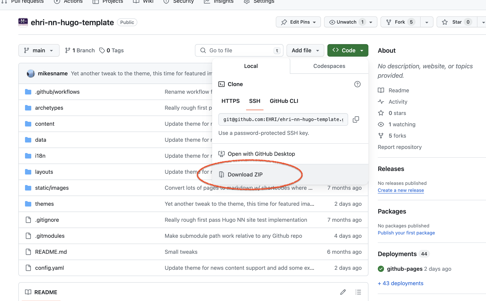

Installing Hugo on Windows
__________________________

Hugo is a command-line interface (CLI) tool and thus requires some basic familiarity with PowerShell or the Command Prompt.
It is convenient to use a package manager such a Chocolatey to install Hugo.

**1) Install Chocolatey**

Chocolatey is an open source package manager for Windows (more here: https://chocolatey.org/).

In PowerShell, enter following command which is bypass the execution policy and download and run the Chocolatey installation script:

.. code-block:: powershell

    Set-ExecutionPolicy Bypass -Scope Process -Force; [System.Net.ServicePointManager]::SecurityProtocol = [System.Net.ServicePointManager]::SecurityProtocol -bor 3072; iex ((New-Object System.Net.WebClient).DownloadString('https://community.chocolatey.org/install.ps1'))

**2) Install Hugo**

Continuing in PowerShell, enter following command:

.. code-block:: powershell

    choco install hugo-extended

.. note::

   The following steps cover downloading and running the template without using Git, but using Git is still the recommended approach.

**3) Create a new folder for the project on your PC.**

**4) Download the template from Github.**

To ensure you have all the files downloaded, it is actually easier to download the .zip archive from here:
https://github.com/EHRI/ehri-nn-hugo-template and unzip the content into your newly created folder.

    Downloading the template from Github

**5) In the Powershell use the cd command to get into your newly created directory with the unzipped project data.**
Enter following command:

.. code-block:: powershell

    cd your/directory/path

**6) Start Hugo server**

Enter following command:

.. code-block:: powershell

    hugo server

**7) Your project is now accessible locally**

Check at http://localhost:1313/.

