Contact Form 7 Tutorial
=======================

This is a tutorial for using `Contact Form 7 <https://contactform7.com/docs/>`_ to create an event registration
form in Wordpress, with some of the functionality previously available in Drupal. While there are many fancier and
more advanced form plugins available for Wordpress, Contact Form 7 (CF7) has the following advantages:

* It is free, and does not nag you to upgrade to a paid version.
* It is lightweight, and does not slow down the site to any significant degree.
* It is `Open Source <https://github.com/rocklobster-in/contact-form-7>`_,
  so the code can be audited for security issues, and is relatively popular
  so any security issues are likely to be found and fixed quickly.
* It is quite stable and unlikely to change significantly in the near future, or break the site
  with a new update.

On the downside, it is not as user-friendly as some other form plugins, and does not have as many
features. However, it is quite powerful and flexible, and can be used to create a wide variety of
forms.

By default, CF7 creates forms that send an email (to the site administrator, or elsewhere.) However,
it integrates with another plugin by the same author, `Flamingo <https://en-gb.wordpress.org/plugins/flamingo/>`_,
to save form submissions to the database. This tutorial will show you how to create a form, embed it in a post,
and view and export submissions.

The Task
--------

We're going to create a registration form for an EHRI event where we request the following
information:

- First Name (required)
- Last Name (required)
- Email (required)
- Institutional Affiliation (optional)
- Checkboxes to indicate which events the participant will attend:

  - Plenary Session: Yes/No
  - WP2 Meeting: Yes/No
  - Conference dinner: Yes/No

- Textarea for dietary requirements (optional)

There are three stages to this:

#. Create the configuration defining the form fields
#. Define how the info from the form will be sent and saved (via Email and the Flamingo plugin)
#. Embed the form in a post and test it

First of all, we need to find the Contact Form 7 menu item in the Wordpress dashboard. In the
dashboard, you should see a menu item called "Contact" with a sub-item called "Contact Forms".

|cf7_image02|

On the Contact Form page, click on "Add New" to create a new form.

|cf7_image03|

This will take you to a new form configuration page.

Form Configuration
------------------

At the top you can see the title of the form, and below that a text box containing the default
form configuration markup. Let's look at this in more detail.

|cf7_image06|

The **default** form configuration code looks like this:

.. code-block::

    <label> Your name
        [text* your-name autocomplete:name] </label>

    <label> Your email
        [email* your-email autocomplete:email] </label>

    <label> Subject
        [text* your-subject] </label>

    <label> Your message (optional)
        [textarea your-message] </label>

    [submit "Submit"]

This example form consists of four fields: *name*, *email*, *subject*, and *message*, plus a submit
button. The fields are defined by the tags in square brackets, with an asterisk indicating that the
field is required. The text before the tag is the label that will be displayed next to the field.

We will replace this default form with our own fields. **Clear the text box** and type the following
into it:

.. code-block::

    <label> First Name (required)
        [text* first-name] </label>

Let's examine what this says:

* The ``<label>`` part **starts** a label
* The ``First Name (required)`` is the text of the label, displayed next to the field.
* The ``[text* first-name]`` part **defines** a text field with the identifier "first-name". This identifier
  is used to refer to the field elsewhere, and should be **lower-case and not contain spaces etc**.
  The asterisk indicates that this field is required. There are more options we can add to this tag, such as
  ``autocomplete:name`` to suggest the user's name when they start typing, but let's skip that for now.
* The ``</label>`` part **ends** the label. Note that the label *wraps* the field element. We could also
  close the label element after the label text, but for text fields this way looks nicer.

Let's continue adding some other fields in the same vein:

.. code-block::

    <label> Last Name (required)
        [text* last-name] </label>

    <label> Email (required)
        [email* your-email] </label>

    <label> Institutional Affiliation (optional)
        [text your-affiliation] </label>

The only new thing here is the email field, which is defined by ``[email* your-email]``. This is
a special type of text field that checks that the input is a valid email address. The other
thing to note is that the field name is "your-email", which is different from the label text "Email".

We also added an extra field for the institutional affiliation, which is optional, because it does not
have an asterisk.

Next, we will add the checkboxes for the events. These are a bit different because we want to have
two options for each event, "Yes" and "No", in order to make it clear that the user must choose one
(and to make processing the data easier.)

.. code-block::

    <label> Plenary Session </label>
        [checkbox* plenary-session add_label_element exclusive "Yes" "No"]

    <label> WP2 Meeting </label>
        [checkbox* wp2-meeting add_label_element exclusive "Yes" "No"]

    <label> Conference Dinner </label>
        [checkbox* conference-dinner add_label_element exclusive "Yes" "No"]

There are a few things to note here:

- We close the labels before the checkboxes. This must be done to avoid CF7 complaining
  about multiple controls in a label.
- The ``add_label_element`` option is used to add a label element to each checkbox. This is
  necessary because the checkboxes are not wrapped in a label element, so we need to add one
  manually. The ``exclusive`` option is used to make sure that only one of the checkboxes can
  be checked.

Next, we will add a textarea for the dietary requirements:

.. code-block::

    <label> Dietary Requirements (optional)
        [textarea dietary-requirements] </label>

Note that this uses the ``textarea`` tag, rather than ``text``, because it is a multi-line text field.

Finally we will add the submit button:

.. code-block::

    [submit "Submit"]

.. note::

    **Note**: the submit button can contain whatever text you want, e.g. "Register", "Send", etc.

Putting this all together gives us the final form configuration:

.. code-block::

    <label> First Name (required)
        [text* first-name] </label>

    <label> Last Name (required)
        [text* last-name] </label>

    <label> Email (required)
        [email* your-email] </label>

    <label> Institutional Affiliation (optional)
        [text your-affiliation] </label>

    <label> Plenary Session </label>
        [checkbox* plenary-session add_label_element exclusive "Yes" "No"]

    <label> WP2 Meeting </label>
        [checkbox* wp2-meeting add_label_element exclusive "Yes" "No"]

    <label> Conference Dinner </label>
        [checkbox* conference-dinner add_label_element exclusive "Yes" "No"]

    <label> Dietary Requirements (optional)
        [textarea dietary-requirements] </label>

    [submit "Submit"]

At this point we can add a name to the form at the top of the page, and click "Save" to save the form.

|cf7_image07|

Mail Configuration
------------------

After saving the form, you will see another tab called "Mail" at the top of the CF7 page:

|cf7_image08|

When someone submits a form, CF7 will send an email. This tab allows you to configure what this email
looks like, who it goes to, and so on. At the top of the config screen it shows you what form fields
are available to include in the mail. You can also include additional pre-defined information such as
``[_site_admin_email]`` and ``[_site_title]``.

|cf7_image08_2|

Since we've just created a registration form with different fields than the default, we need to change
the standard mail configuration template. For now, we can leave the **To** and **From** fields as the
default, which will send the email to the site administrator and use a default email address as the
sender, but you could for example put your own email address as the **To** recipient.

We'll start by changing the **Subject** field to ``[_site_title]: "EHRI 2025 Event New Registration"``. Note that
we get rid of the default ``"[your-subject]"`` and replace it with a more descriptive subject line, because
``your-subject`` is not a valid field in our form.

Next, we'll change the **Message Body** of the email to include all the form fields. You can use the form field names
in square brackets to include the values of the fields in the email. For example, to include the first name
field, you would use ``[first-name]``. You can also include text in the email, such as "First Name: [first-name]".
Here is an example of what the email body might look like:

.. code-block:: text

    New EHRI Event 2025 Registration Form Submission:

    First Name: [first-name]
    Last Name: [last-name]
    Email: [your-email]
    Institutional Affiliation: [your-affiliation]
    Plenary Session: [plenary-session]
    WP2 Meeting: [wp2-meeting]
    Conference Dinner: [conference-dinner]
    Dietary Requirements: [dietary-requirements]

Don't bother checking either of the checkboxes below the message box, and click "Save" to save the mail configuration.

Additional Settings
-------------------

Before we move on to embedding the form in a post and testing it, we can set some additional settings to make the
information stored by the Flamingo plugin more useful. Click on the "Additional Settings" tab at the top of the page:

|cf7_image09|

Here, there's basically just a text box where you can put some key/value pairs. Flamingo can use the following
values to store additional information about the form submission, referencing the info in the form:

.. code-block::

    flamingo_email: "[your-email]"
    flamingo_name: "[first-name] [last-name]"
    flamingo_subject: "EHRI Event 2025 Registration"

You can paste that information right into the text box, and click "Save" to save the additional settings.

|cf7_image10|

For now we're done with the form configuration. Note that there is another tab called "Messages" which allows you to
configure the messages that are displayed to the user when they submit the form. You can leave these as the default
for now, but you can come back and change them later if you want.

Creating a Post
---------------

Next, we're going to create a new post and embed the form in it, using a Wordpress shortcode.

Notice on the form configuration page that there is a shortcode at the top of the page that you can use to embed the
form in a post, which looks like ``[contact-form-7 id="1234" title="EHRI Event 2025 Registration"]``. Select this
and copy it.

Now, go to the Wordpress dashboard and click on "Posts" in the left-hand menu. Click on "Add a New Post" at the top.

Add a title to the post like "EHRI Event 2025 Registration Form" and hit enter to start a new paragraph. Below the title
you can add some text to introduce the form, such as:

    Please fill out the form below to register for the EHRI Event 2025.

Now paste the shortcode you copied earlier into the post, e.g:

    [contact-form-7 id="97e2bdc" title="EHRI Event 2025 Registration"]

|cf7_image12|

Before you publish the post, you can preview it to see what the form looks like. Click on the "Preview" button at the top
right of the page. The resulting preview page should look like this:

|cf7_image13|

If all looks good, click on the "Publish" button to publish the post.

Testing the Form
----------------

Now you can test the form by going to the post and filling it out. On submitting the form, the site should show the
default message, which is "Thank you for your message. It has been sent." If you want you can change this in the
"Messages" tab of the form configuration, so it says something more appropriate like "Thank you for registering for
the EHRI Event 2025."

To view the form submissions using the Flamingo plugin, go to the Wordpress dashboard and click on "Flamingo" in the
left-hand menu. The default view is called the "Address Book", which includes various other information about the
system such as newly-registered users. On the right hand menu you can click on "Inbound Messages" to see just the form
submissions, which should include:

- The subject, as defined by the ``flamingo_subject`` value in the additional settings
- The name, as defined by the ``flamingo_name`` value in the additional settings
- The email address, as defined by the ``flamingo_email`` value in the additional settings
- The date and time the form was submitted

The default inbound messages view shows submissions from all forms, but you can filter by form by clicking on the
dropdown menu that says "View all channels" at the top and choose your new form from the options.

Once you have selected the inbound messages from just the form you created, you can click on the "Export" button at the
top right to export the submissions to a CSV file.

|cf7_image14|

The data in the CSV file you export will include all the fields from the form, as well as the date and time the form
was submitted, e.g.:

.. csv-table:: Flamingo Export Example
   :file: flamingo-export.csv
   :header-rows: 1
   :class: longtable

**That's it! You've created a form, embedded it in a post, and tested it. You can now view and export the submissions.**

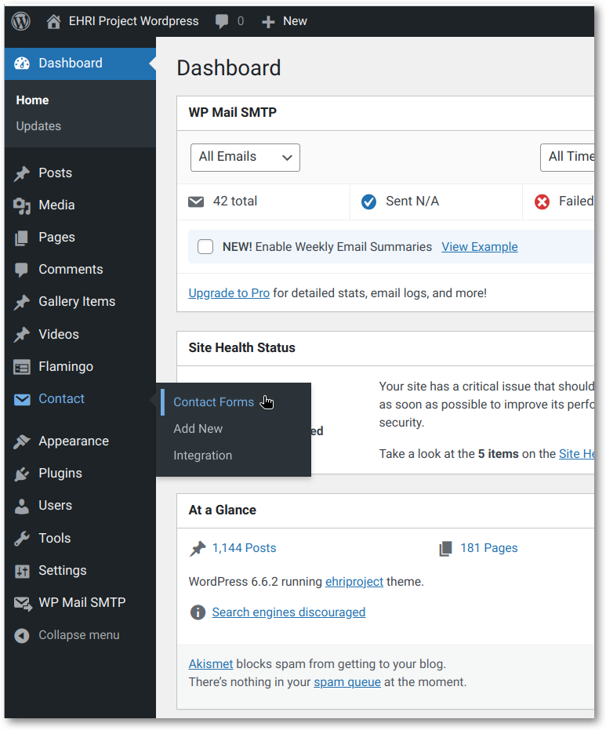
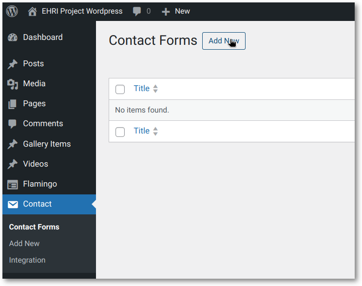
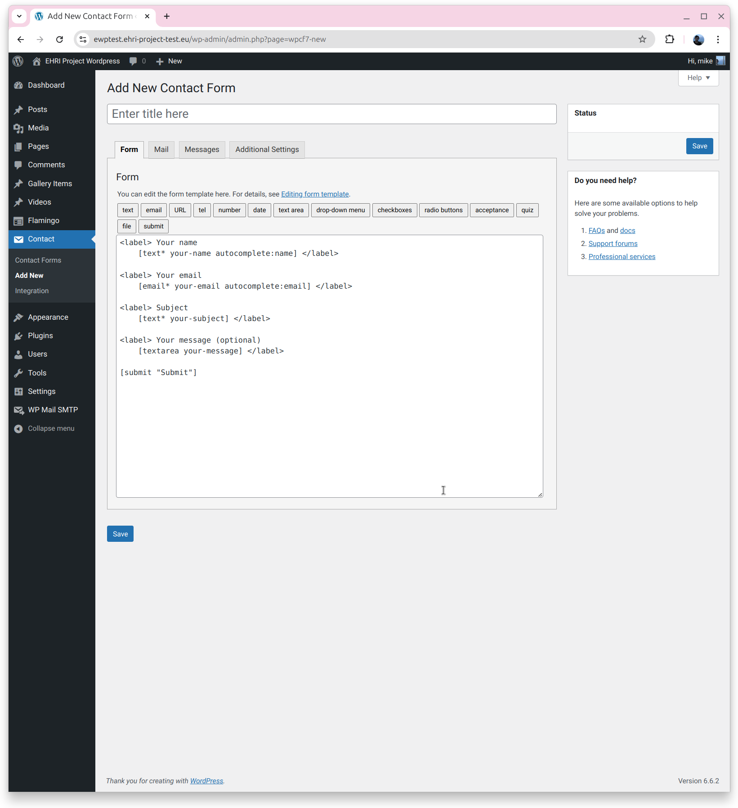
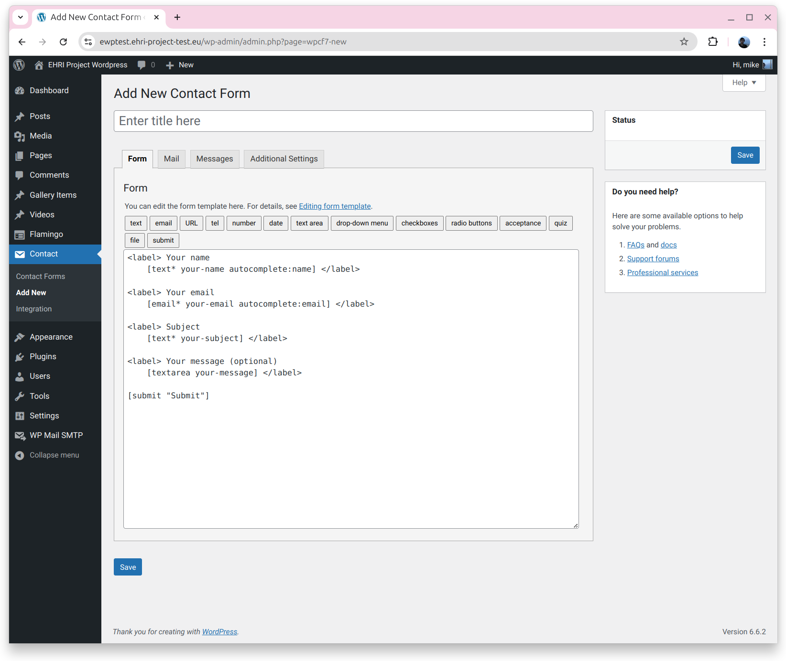
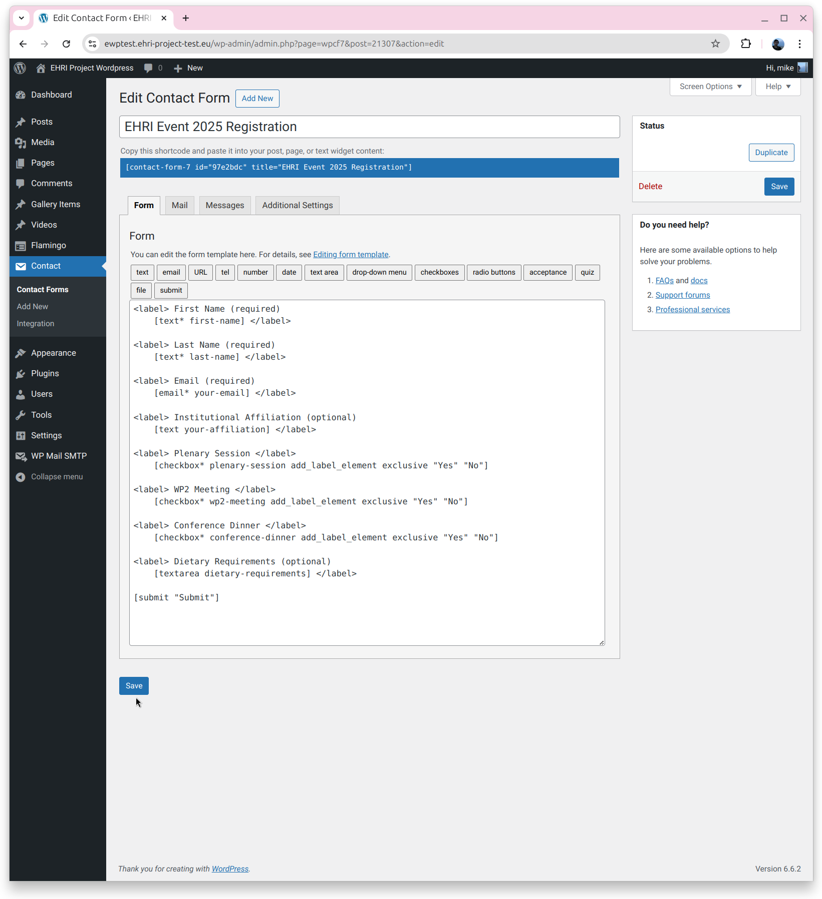
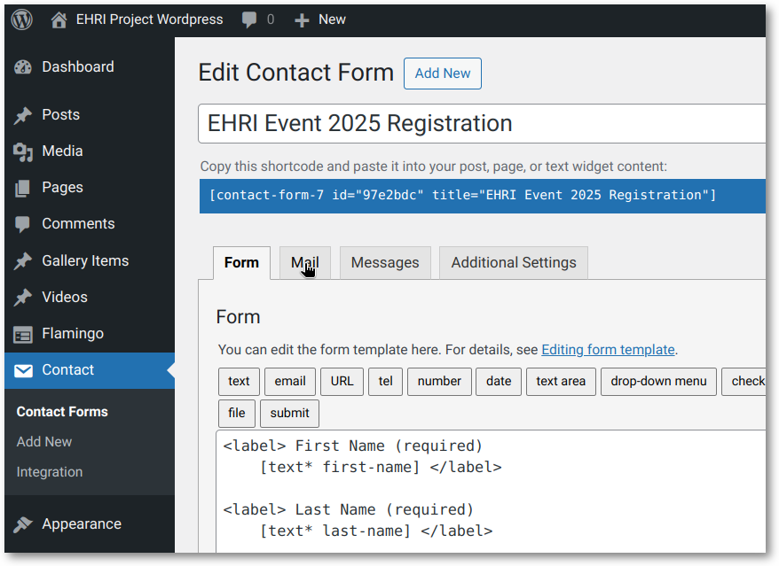
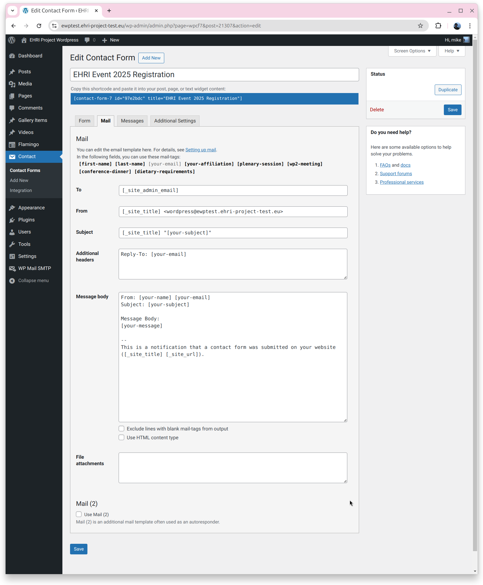
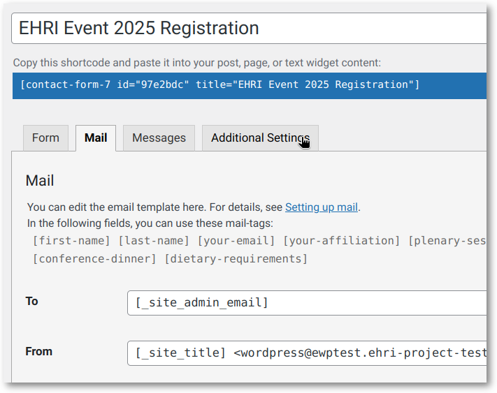
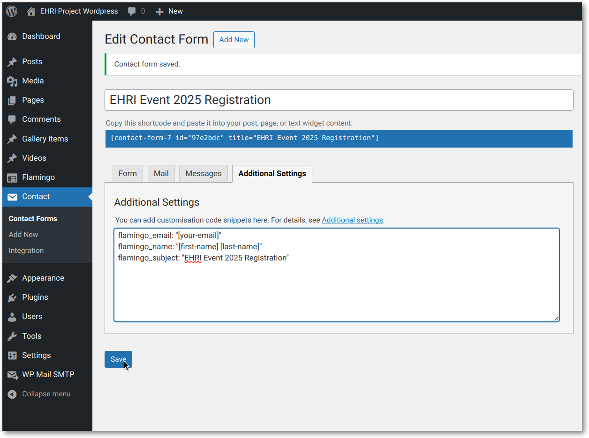
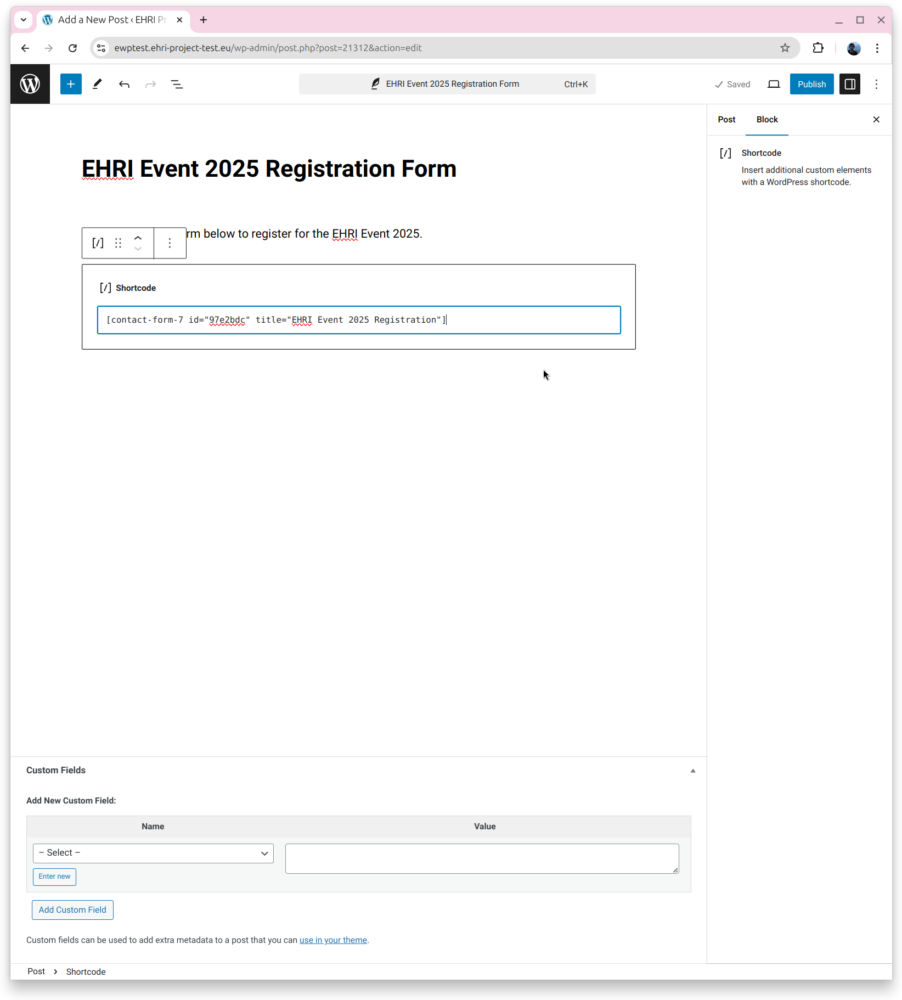
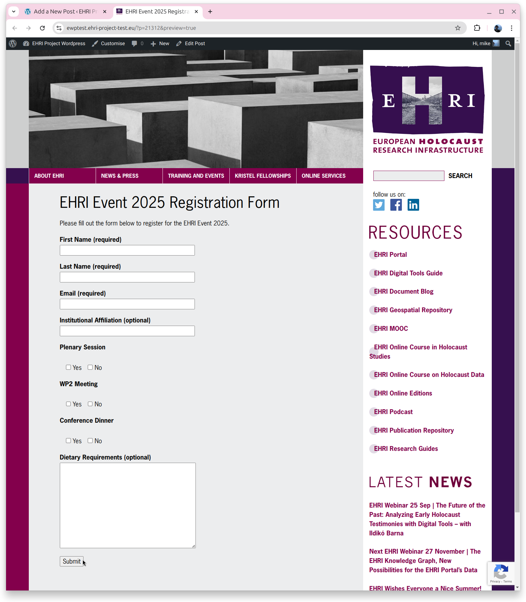
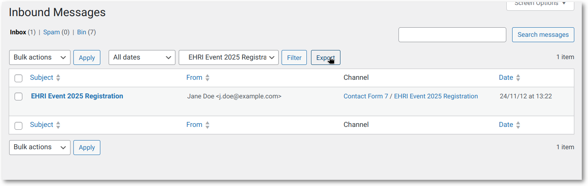