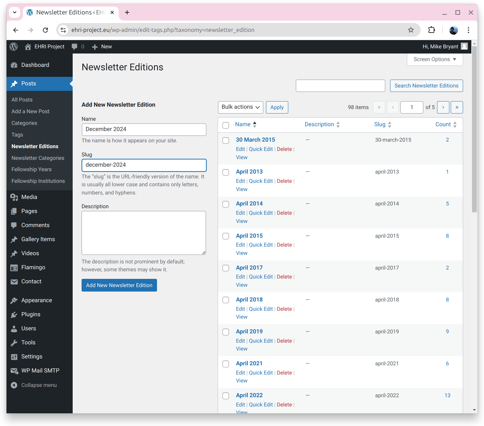
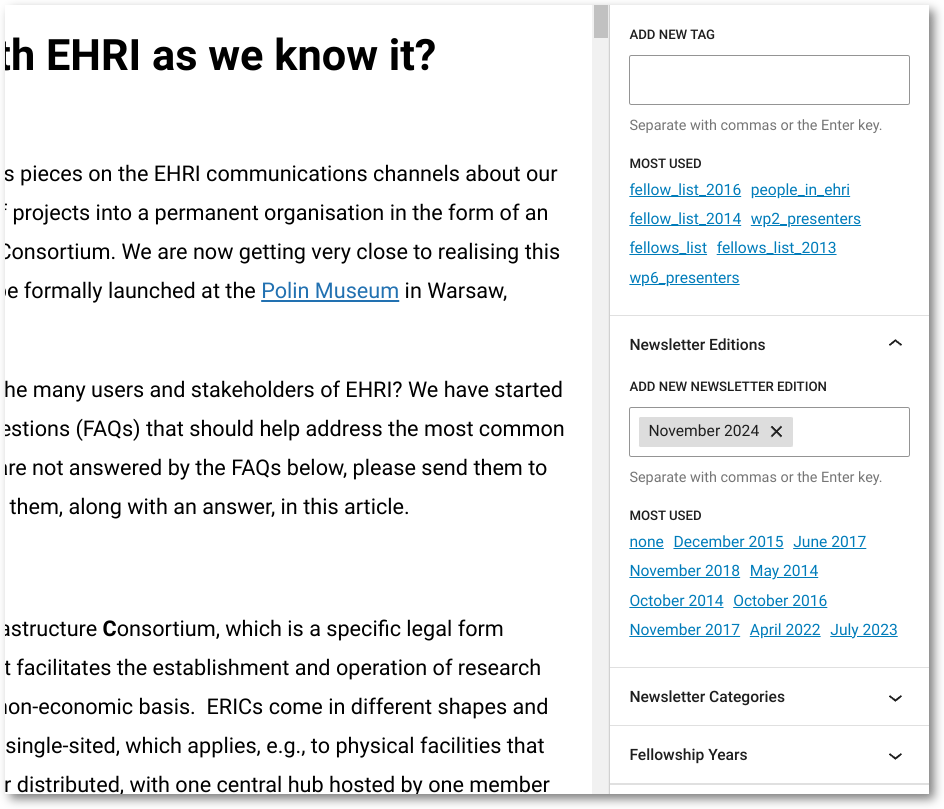
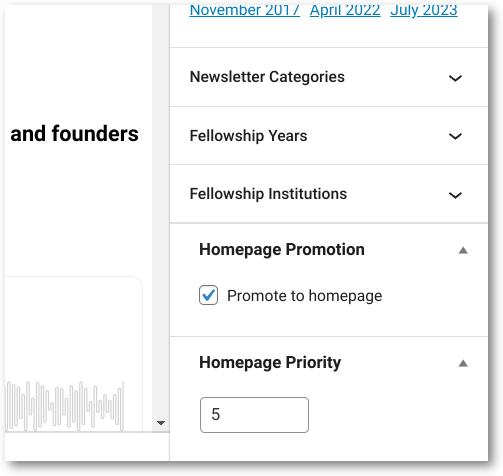

EHRI Project Site Documentation
===============================

Since November 2024 the EHRI project site has been migrated over to Wordpress, available as before at `<https://www.ehri-project.eu>`_.

**Please** let the administrator know if you see issues with content such as 404 pages, missing images, or broken download links.

To log in to the administration pages, please go to `<https://www.ehri-project.eu/ehri-login/>`_.

.. note :: **Note** that this is different from the default Wordpress login page! A bit of security through obscurity.

How tos:
--------

#. `How to create a new page or post, and whether to use a page or a post <#creating-content-pages-or-posts>`_.

#. `How to build a newsletter and find its HTML view page for Mailchimp <#building-the-ehri-newsletter-and-finding-the-html-view-page-for-mailchimp>`_.

#. `How to order the front page <#ordering-the-front-page>`_

#. `How to create a form with the Contact Form 7 & Flamingo plugins, create a post for it, and where to find submissions <cf7-tutorial/index.html>`_

Creating content: Pages or Posts?
~~~~~~~~~~~~~~~~~~~~~~~~~~~~~~~~~

In Wordpress there are by default two types of content: **pages** and **posts**. The difference between the two is that pages are
intended for permanent "static" content, such as the "About EHRI" page, while posts are intended for more transient content,
such as news. In practice, the distinction is not always clear, but here are some guidelines:

- **Posts**
   - Use posts for news, events, and other content that is time-sensitive.
   - Posts can be **tagged** and **categorised**, which can be useful for filtering content.

- **Pages**
   - Use pages for anything permanent that should appear in a site menu item, for example
     "About EHRI", "Contact", "Partners", etc.

.. note::

    **Note**: for the **Podcast**, things are currently a bit confusing. The podcast list is a page, but the individual podcast
    episodes are posts, with the category "Podcast Episode". In the future, we may want to make individual pages for podcast
    seasons and being able to tag and categorise episodes could be useful.

.. note ::

   **How has Drupal content been migrated?**

   - **Pages** in Drupal have mostly been migrated as Wordpress pages, with the exception of a few podcast episodes. This includes
     all the "about" EHRI pages, the "contact" page, and the "partners" page, etc, plus pages about people who work
     for EHRI. Everything else is a post.

   - **News** in Drupal have been migrated as Wordpress posts.

   - **Gallery Items** in Drupal have been migrated as the custom Wordpress post type "Gallery Item", but this might
     change in the future.

   - **Videos** in Drupal have been migrated as the custom Wordpress post type "Video", but this might also change in the future.

   - **Webform** in Drupal have been migrated as the custom Wordpress pages, but are missing the actual form itself.

   **What couldn't be migrated?**

   Forms are the main thing, along with the custom themes for past EHRI conferences (though the content should still exist.)

Building the EHRI Newsletter and finding the HTML view page for Mailchimp
~~~~~~~~~~~~~~~~~~~~~~~~~~~~~~~~~~~~~~~~~~~~~~~~~~~~~~~~~~~~~~~~~~~~~~~~~

The way the newsletter currently works is that there is a custom taxonomy called "Newsletter Edition" that contains
an item for each newsletter, e.g. "november-2024". Then pages or posts that are part of the newsletter are added to
the corresponding newsletter edition.

Creating a new newsletter edition item
_______________________________________

In the Wordpress dashboard, click on "Posts" and then "Newsletter Edition" on the left-hand menu. This will show a list
of all newsletter editions on the right and a form on the left:

|project_site_new_newsletter_edition|

Adding pages or posts to a newsletter edition
_____________________________________________

To add pages or posts to a newsletter edition, go to the page or post and in the "Newsletter Edition" field, select the
newsletter edition you want to add it to:

|project_site_add_post_to_newsletter_edition|

Finding the HTML view page for Mailchimp
________________________________________

Finally, when you're ready to post the newsletter in Mailchimp, find the HTML view page by going to the list page for
the newsletter edition by going back to "Posts" and clicking on the newsletter edition. Then click on the "View" link
next to the newsletter edition you want to view. This will show the newsletter in HTML format, and you can copy the
URL (or the HTML) into Mailchimp.

The URL will be something like ``https://www.ehri-project.eu/newsletter-edition/november-2024/`` where "november-2024" is
the slug of the newsletter edition.

Ordering the Front Page
~~~~~~~~~~~~~~~~~~~~~~~

In general, for a page or post to appear on the front page it must be:

#. Published
#. Have a featured image
#. Have the "Promote to front page" checkbox checked

Assuming only the above the front page is ordered by most-recent first. However, you can override this by
putting a number in the "Homepage priority" field, available in the settings of a page or post. The lower the number,
the higher the priority, so a page with a priority of 1 will appear before a page with a priority of 2.

|project_site_homepage_order|

If you want to remove a page from the front page, simply uncheck the "Promote to front page" checkbox. Alternately,
if it's an older post/page, **clear** the "Homepage priority" field and save it.

.. note::
   **Note**: homepage ordering needs a rethink so let the administrator know if you have a better idea of how to do it!

Creating a form with Contact Form 7 & Flamingo
~~~~~~~~~~~~~~~~~~~~~~~~~~~~~~~~~~~~~~~~~~~~~~~

The form tutorial is available `here <cf7-tutorial/index.html>`_.

