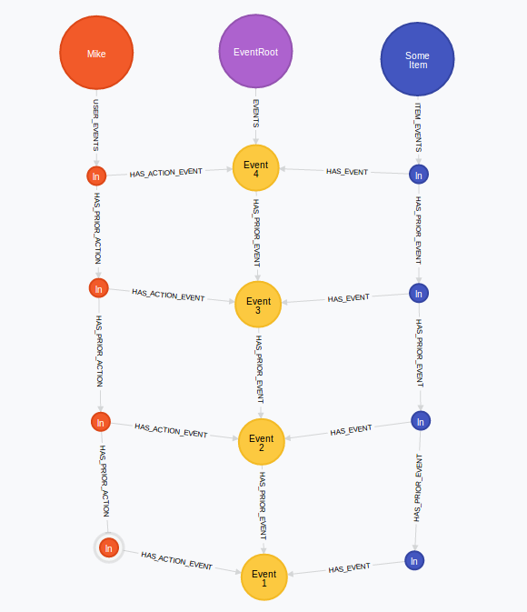

Audit Log
=========

The backend audit log is a database-global chain of events (the ``SystemEvent`` model) which forms a linked list,
with the most-recent event at the head of the chain. ``SystemEvent`` item have a single ``Actioner`` (who made the
change) and one or many ``Accessible`` subject nodes. The subject nodes and actioner each have their own chain of 
events attached, recording their change history and actions they have taken, respectively.

You might think this sounds like a complicated system, and unfortunately it is. The rationale was to make it easy and
fast to get the most-recent events pertaining to items in the database and the system as a whole, while also preventing
scaling issues caused by having potentially thousands of event nodes attached to a single ``Actioner`` node (since
individual users could easily make thousands of changes over the course of the project.)

The downside is complexity, and it also makes reaching far back through past events fairly slow, since the event chain
structure gets longer with each database change. 

Below is a diagram of the node graph formed by the audit log (**ignore the actual relationship names in this example**):

Interactions with the audit log are handled by the ``ActionManager`` class, accessed via the ``Api.actionManager()``
method. When new changes are to be made to some data item, a new ``EventContext`` is created for the current user and
the particular event type. One or more subject items can be added to this event context, which is then committed at the
end of the process. This prevents creating invalid events when exceptions are thrown during the process.

The ``EventsApi`` interface is a separate class for retrieving events from audit log, and supports aggregating events in
two ways:

User Aggregation
  All consecutive events initiated by the same user are aggregated.

Strict Aggregation
  Aggregates events which are a) consecutive, b) have the same scope and subject(s), c) are by the same user and, d) have 
  the same log message (if given).

  This is intended for the case when a user updates a particular item many times in a row, making small changes.

